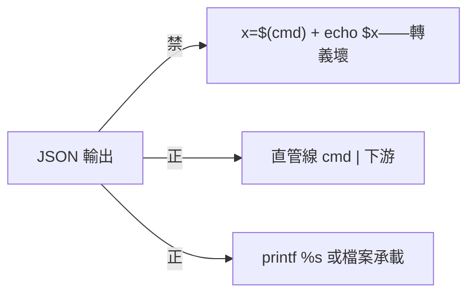

## Description

<!-- SECTION:DESCRIPTION:BEGIN -->
SC 值星提案（附 bridge 歸證 leg 實證）：zsh builtin echo 會解釋反斜線轉義——JSON 經 `$(cmd)`＋echo 往返必壞（\n 變真 LF、\\ 折半）。正確寫法＝直管線（cmd | 下游）、printf %s、或檔案承載。

**做什麼**：tool-discipline skill 的 zsh 細則節補這條陷阱與正確形（3 行內）；含實證來源標註（bridge 歸證 leg，2026-10-06）。

<!-- SECTION:DESCRIPTION:END -->
