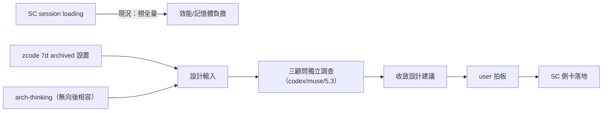

## Description

<!-- SECTION:DESCRIPTION:BEGIN -->
user 糾正（2026-10-06 12:34，於 SC session）：SC session loading 機制有問題——撈到全量歷史；zcode 有 7 天 archived 設置可借；arch-thinking 面不用向後相容，看怎樣做比較好；派 codex/muse/5.3 好好調查分析討論後收斂。

**做什麼**：三顧問獨立調查（事實先備：SC 側 loading 代碼路徑＋現況行為＋zcode 7d archive 語義）→ 收斂設計建議 → user 拍板 → SC 側卡承接（southchariot repo）。

**不做**：不改 SC repo（對方主權——產出設計建議與討論收斂，落地歸 SC 卡）。

<!-- SECTION:DESCRIPTION:END -->
