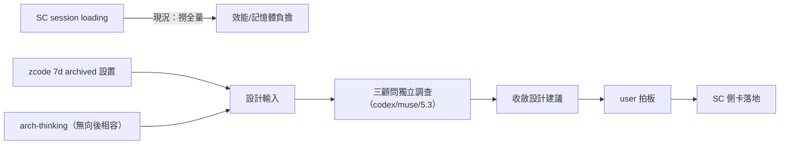
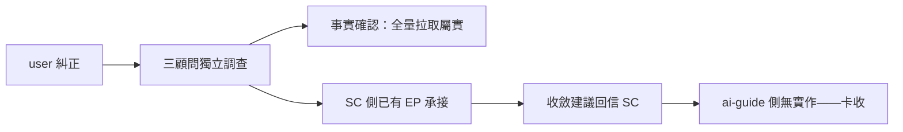

## Description

<!-- SECTION:DESCRIPTION:BEGIN -->
user 糾正（2026-10-06 12:34，於 SC session）：SC session loading 機制有問題——撈到全量歷史；zcode 有 7 天 archived 設置可借；arch-thinking 面不用向後相容，看怎樣做比較好；派 codex/muse/5.3 好好調查分析討論後收斂。

**做什麼**：三顧問獨立調查（事實先備：SC 側 loading 代碼路徑＋現況行為＋zcode 7d archive 語義）→ 收斂設計建議 → user 拍板 → SC 側卡承接（southchariot repo）。

**不做**：不改 SC repo（對方主權——產出設計建議與討論收斂，落地歸 SC 卡）。

<!-- SECTION:DESCRIPTION:END -->

## Acceptance Criteria
<!-- AC:BEGIN -->
- [x] #1 三顧問獨立調查完成——file:line 舉證（sessions.ts:304-315/564-570 等）
- [x] #2 設計建議收斂＋回信 SC（4eb331e0）
- [x] #3 SC 側已有 EP 承接——ai-guide 無實作面，卡以調查交付收案
<!-- AC:END -->

## Final Summary

<!-- SECTION:FINAL_SUMMARY:BEGIN -->
SC session loading 撈全量調查完成：三顧問（muse/codex/5.3）獨立調查收斂——問題確認（每次刷新兩條 limit:2000 全量拉取＋codex 全量、最重 177.9s、跨 102 workspace）但 transcript 面已視窗化非瓶頸；zcode 7d archive 不可靠為載入機制（查詢觸發＋gate 預設 false）。SC 側已有成形 EP（1006-session-loading-redesign L0/L1/L2）承接——純 SC 側改動，ai-guide 無實作。收斂建議已回信 SC（message 4eb331e0）。

<!-- SECTION:FINAL_SUMMARY:END -->
