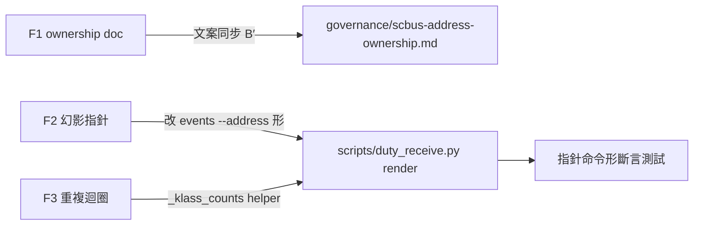
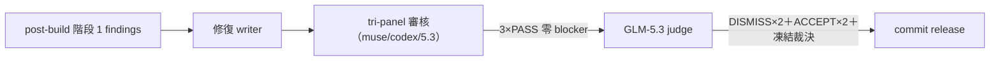

## Description

<!-- SECTION:DESCRIPTION:BEGIN -->
post-build 階段 1 審查（弧 ade9a195..af1d32dd）三筆 findings 修復：F1 governance 治理文檔殘留已退役的 monitor 文案（drift）；F2 摘要行指針是不可執行的幻影命令（dutymail events 無 envelope-id 過濾參數）；F3 render() class 計數迴圈重複。

**做什麼**：三筆修復＋指針命令形測試斷言（詳 Plan）。

<!-- SECTION:DESCRIPTION:END -->

## Acceptance Criteria
<!-- AC:BEGIN -->
- [x] #1 101 tests 綠＋全套 3359（fix commit 前後各驗）
- [x] #2 recovery window governance/hooks 零命中
- [x] #3 新指針可執行（events --address 形）＋幻影回歸測試釘住
- [x] #4 tri-panel 3×PASS＋GLM-5.3 judge 凍結裁決（0 blocker 0 變更）
<!-- AC:END -->

## Final Summary

<!-- SECTION:FINAL_SUMMARY:BEGIN -->
post-build 階段 1 三筆 findings 修復完成並經 user 指定管線驗收：tri-panel 審核（muse/codex/GLM-5.3 三腿獨立——3×PASS、零 blocker；兩 Info 與兩分歧點由 GLM-5.3 judge 全數 DISMISS/ACCEPT-codex 側，零變更）→ 凍結現況文本 commit release。修復內容：F1 governance 引文與 monitor 現行文案逐字同步＋B′ 常態註記；F2 摘要行指針改可執行形（dutymail events --address <alias>；ids 對照段保留）＋幻影回歸測試；F3 class 計數迴圈抽 _klass_counts helper。101 tests 綠＋recovery window 全域歸零＋ruff 乾淨。

<!-- SECTION:FINAL_SUMMARY:END -->
