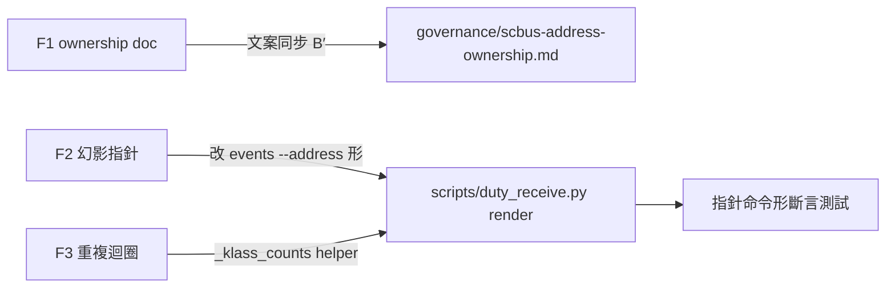

## Description

<!-- SECTION:DESCRIPTION:BEGIN -->
post-build 階段 1 審查（弧 ade9a195..af1d32dd）三筆 findings 修復：F1 governance 治理文檔殘留已退役的 monitor 文案（drift）；F2 摘要行指針是不可執行的幻影命令（dutymail events 無 envelope-id 過濾參數）；F3 render() class 計數迴圈重複。

**做什麼**：三筆修復＋指針命令形測試斷言（詳 Plan）。

<!-- SECTION:DESCRIPTION:END -->
