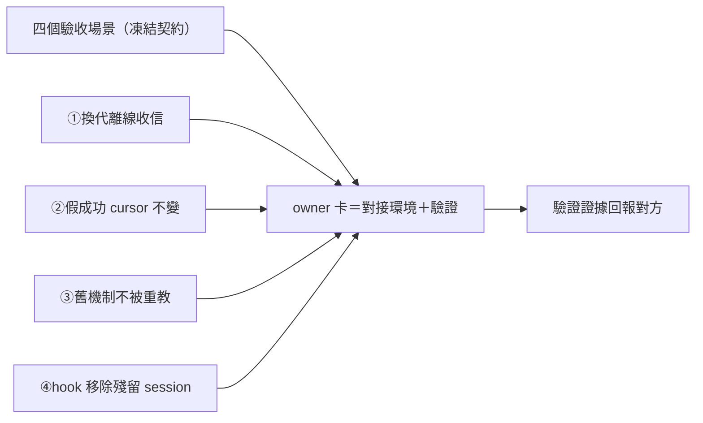

## Description

<!-- SECTION:DESCRIPTION:BEGIN -->
信箱系統換裝（dutymail 遷移）的最後一塊拼圖：對方 repo（delegate-bridge）定義了四個驗收場景，指定 ai-guide 這邊開 owner 卡負責對接與驗證——信箱換代時信不丟、假的成功報告不會吃信、已退役的舊掛名機制不被任何活躍文檔偷偷教回來、舊 hook 移除後既有 session 不壞。

**做什麼**：四場景逐項在 ai-guide 側準備環境＋跑驗證：①值星換代期間離線到信，新 holder 能收到②harness 假成功丟輸出時，信件 cursor 紋風不動③舊掛名機制（已退役）反掃活躍 instruction 面——零重教④hook 移除後殘留/新開 session 行為（installer 已有移除警示）組合驗證。

**規矩**：測試語義以對方凍結契約為準（本卡不重定義）；不動對方 repo；memory 編輯需另授權。

（代號指針：源卡＝delegate-bridge backlog db-80.6；場景＝TC-C4..C7，定義凍結於 00-tasks/2026-10/10-04-dutymail/test-contracts.md；③所指＝本 repo AIR-254.2 退役面）
<!-- SECTION:DESCRIPTION:END -->
