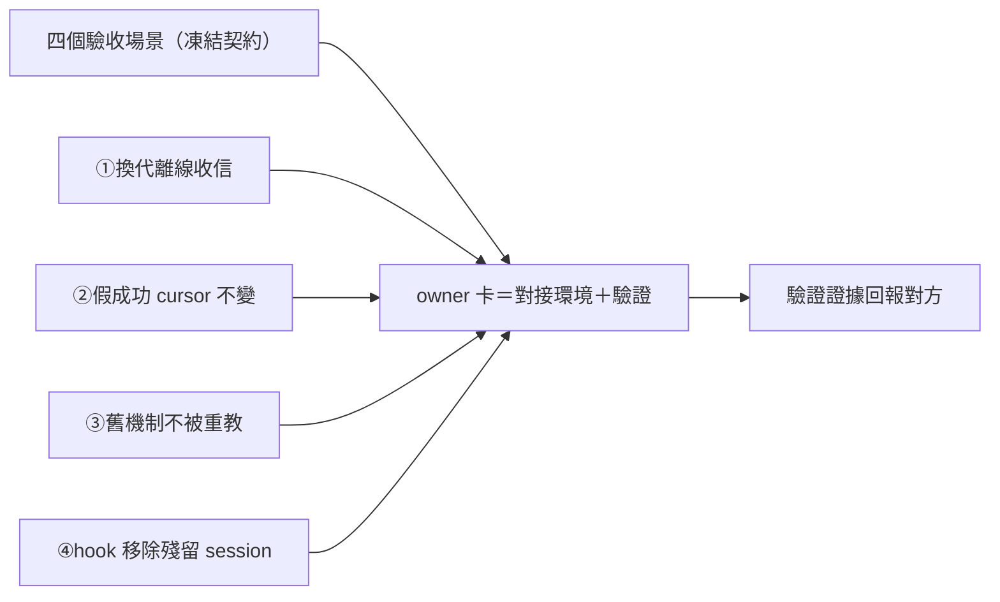
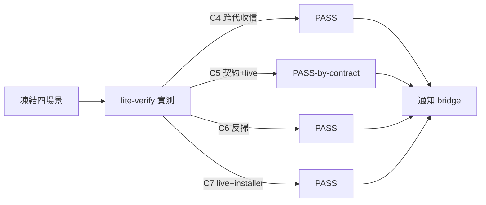

## Description

<!-- SECTION:DESCRIPTION:BEGIN -->
信箱系統換裝（dutymail 遷移）的最後一塊拼圖：對方 repo（delegate-bridge）定義了四個驗收場景，指定 ai-guide 這邊開 owner 卡負責對接與驗證——信箱換代時信不丟、假的成功報告不會吃信、已退役的舊掛名機制不被任何活躍文檔偷偷教回來、舊 hook 移除後既有 session 不壞。

**做什麼**：四場景逐項在 ai-guide 側準備環境＋跑驗證：①值星換代期間離線到信，新 holder 能收到②harness 假成功丟輸出時，信件 cursor 紋風不動③舊掛名機制（已退役）反掃活躍 instruction 面——零重教④hook 移除後殘留/新開 session 行為（installer 已有移除警示）組合驗證。

**規矩**：測試語義以對方凍結契約為準（本卡不重定義）；不動對方 repo；memory 編輯需另授權。

（代號指針：源卡＝delegate-bridge backlog db-80.6；場景＝TC-C4..C7，定義凍結於 00-tasks/2026-10/10-04-dutymail/test-contracts.md；③所指＝本 repo AIR-254.2 退役面）
<!-- SECTION:DESCRIPTION:END -->

## Acceptance Criteria
<!-- AC:BEGIN -->
- [x] #1 C4 PASS——跨代收信兩實例＋cursor 連續＋named trigger 在場
- [x] #2 C5 PASS-by-contract——契約凍結＋live 空 prepare 不動 cursor
- [x] #3 C6 PASS——scbus rename 六目錄零命中＋新慣例在場
- [x] #4 C7 PASS——live config 乾淨＋installer 五面綠
<!-- AC:END -->

## Final Summary

<!-- SECTION:FINAL_SUMMARY:BEGIN -->
信箱換裝四場景驗證 4/4 PASS（獨立 lite-verify 腿實測）：C4 換代收信（events timeline 兩跨代實例＋cursor 連續＋named trigger 在場）；C5 假成功防護（契約凍結＋live 空 prepare 不動 cursor）；C6 舊機制反掃（scbus rename 六目錄零命中＋新慣例四檔在場）；C7 hook 移除殘留（live config 乾淨＋installer 五面綠＋restart receipt）。Evidence：.agent-tmp/air262/。已通知 bridge（envelope air-dbwaves-tc-c4c7-verified-001）——db-80.6 AC#2 ai-guide 側完備。

<!-- SECTION:FINAL_SUMMARY:END -->
