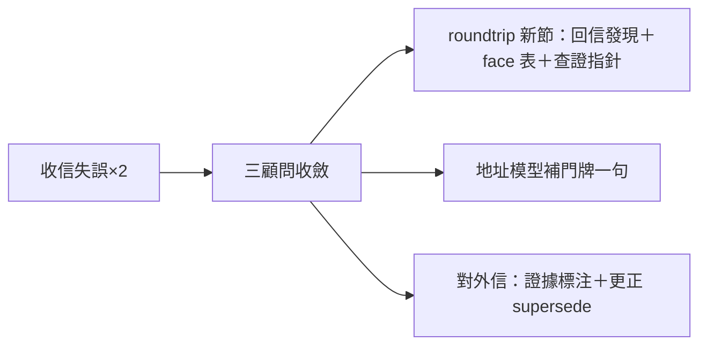

## Description

<!-- SECTION:DESCRIPTION:BEGIN -->
今天兩次收信失誤（漏行動項、錯查詢形＋錯誤歸因外流）的教學對策——三顧問（muse/codex/5.3）收斂的最小集落地：信件文檔補「回信發現與收信面」節＋兩處一行補充。

**做什麼**：①roundtrip 文檔新增一節——回信發現正典（scoped 查詢唯一正典、跨地址禁 unscoped、回空不是語義證據）＋五個面的用途小表（哪個面讀信、哪個面只能計數、events 無 body）＋查證一行（回空只授權「此形下未見」＋就近真相源指針）②地址模型節補一句門牌建立慣例③對外信慣例（斷言攜證據或自標推測；更正信顯式 supersede）。

**不做**：不動 rules 層（教學先行、復發再升級）；不自造 unscoped 語義定義（權威在 bridge，只放指針）。

<!-- SECTION:DESCRIPTION:END -->
