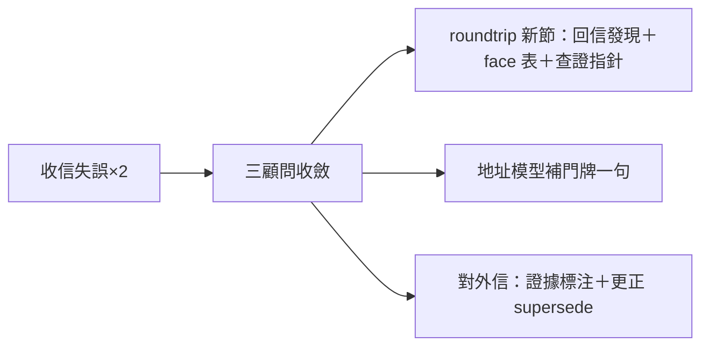
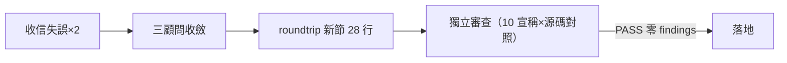

## Description

<!-- SECTION:DESCRIPTION:BEGIN -->
今天兩次收信失誤（漏行動項、錯查詢形＋錯誤歸因外流）的教學對策——三顧問（muse/codex/5.3）收斂的最小集落地：信件文檔補「回信發現與收信面」節＋兩處一行補充。

**做什麼**：①roundtrip 文檔新增一節——回信發現正典（scoped 查詢唯一正典、跨地址禁 unscoped、回空不是語義證據）＋五個面的用途小表（哪個面讀信、哪個面只能計數、events 無 body）＋查證一行（回空只授權「此形下未見」＋就近真相源指針）②地址模型節補一句門牌建立慣例③對外信慣例（斷言攜證據或自標推測；更正信顯式 supersede）。

**不做**：不動 rules 層（教學先行、復發再升級）；不自造 unscoped 語義定義（權威在 bridge，只放指針）。

<!-- SECTION:DESCRIPTION:END -->

## Acceptance Criteria
<!-- AC:BEGIN -->
- [x] #1 新節在場（rg 命中）
- [x] #2 face 表五列＋events 禁讀信面在場
- [x] #3 對外信證據慣例＋supersede 條款在場
- [x] #4 恰一檔 +28 行；獨立審查 PASS 零 findings（四欄回執）
<!-- AC:END -->

## Final Summary

<!-- SECTION:FINAL_SUMMARY:BEGIN -->
收信教學最小集落地（tri-consultant muse/codex/5.3 收斂定稿語義照抄）：roundtrip 新增「回信發現與收信面」節——①回信發現正典（scoped --address <self> 唯一正典；跨地址禁 unscoped——parent 出現地址推導 scope 跨 repo 查錯邊合法回空；回空不蘊含語義；wait→status→prepare→replies 鏈）②face 五行表（wait/events/status/prepare/replies 用途×不能推什麼——events 無 body 禁當讀信面）③查證一行（回空只授權「此形下未見」＋就近真相源指針）④對外信慣例（斷言攜證據或自標未查證推測；更正信顯式 supersede）＋地址模型補門牌建立一句。獨立審查 PASS 零 findings（10 條宣稱×bridge 源碼逐條對照——observe.rs TC-D13 定義性 commit 對上；四欄回執記 FS）。

<!-- SECTION:FINAL_SUMMARY:END -->
