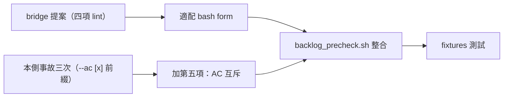
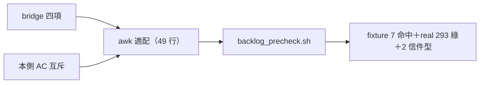

## Description

<!-- SECTION:DESCRIPTION:BEGIN -->
bridge 側提案採納（delegate-bridge 信箱事故實證：SC ext 撞 Unparsed 三張卡——frontmatter 重複 key/section 雙包裹/孤兒散文）：跨線掃描（backlog_precheck.sh）加 frontmatter lint——錯誤在清板時就攔，不用等 SC ext 端使用者撞。

**做什麼**：backlog_precheck.sh 加零依賴 shell lint——五項檢查（bridge 四項＋本側加一項）：①首行/閉合 --- ②frontmatter 重複 top-level key ③tab 縮排 ④未閉合雙引號 ⑤AC 行外框 checkbox 與內容 [x] 前綴互斥（本側今天三次同型事故）。掃 tasks/completed/drafts/archive 四目錄，命中列檔名+key+行號 exit 1。

**參考實作**：delegate-bridge tests/backlog-frontmatter.test.mjs 的 lintBacklogFrontmatter（~100 行零依賴）——適配為 bash form（precheck 是 shell script）＋四 fixtures 適配＋(e) 項 fixture。

<!-- SECTION:DESCRIPTION:END -->

## Acceptance Criteria
<!-- AC:BEGIN -->
- [x] #1 五項 fixture 逐項命中＋好形零誤報（RED→GREEN）
- [x] #2 real board 293 卡全綠＋兩 drafts handoff 信件型命中（真命中非誤報——查證屬實）
- [x] #3 純新增 50 行不動既有邏輯；bash -n 乾淨
- [x] #4 bridge 參考語義對齊（lintBacklogFrontmatter）；exit 語義一致（命中 1/失敗 2）
<!-- AC:END -->

## Final Summary

<!-- SECTION:FINAL_SUMMARY:BEGIN -->
frontmatter lint 落地：backlog_precheck.sh 加五項零依賴 awk lint（49 行）——①首行/閉合 frontmatter ②重複 top-level key（bridge 事故型）③tab 縮排 ④未閉合雙引號 ⑤AC 行外框 checkbox 與內容 [x] 前綴互斥（本側今天三次事故型）。fixture 七命中（五壞形逐一＋好形零誤報）＋real board 293 卡全綠唯二命中＝drafts 兩封 handoff 信件型檔（非卡形——處置待 user：補 frontmatter／移出／排除規則）。

<!-- SECTION:FINAL_SUMMARY:END -->
