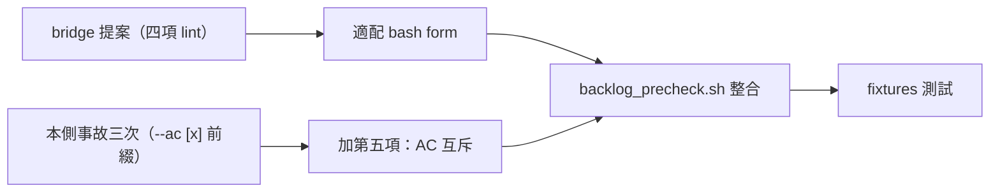

## Description

<!-- SECTION:DESCRIPTION:BEGIN -->
bridge 側提案採納（delegate-bridge 信箱事故實證：SC ext 撞 Unparsed 三張卡——frontmatter 重複 key/section 雙包裹/孤兒散文）：跨線掃描（backlog_precheck.sh）加 frontmatter lint——錯誤在清板時就攔，不用等 SC ext 端使用者撞。

**做什麼**：backlog_precheck.sh 加零依賴 shell lint——五項檢查（bridge 四項＋本側加一項）：①首行/閉合 --- ②frontmatter 重複 top-level key ③tab 縮排 ④未閉合雙引號 ⑤AC 行外框 checkbox 與內容 [x] 前綴互斥（本側今天三次同型事故）。掃 tasks/completed/drafts/archive 四目錄，命中列檔名+key+行號 exit 1。

**參考實作**：delegate-bridge tests/backlog-frontmatter.test.mjs 的 lintBacklogFrontmatter（~100 行零依賴）——適配為 bash form（precheck 是 shell script）＋四 fixtures 適配＋(e) 項 fixture。

<!-- SECTION:DESCRIPTION:END -->
