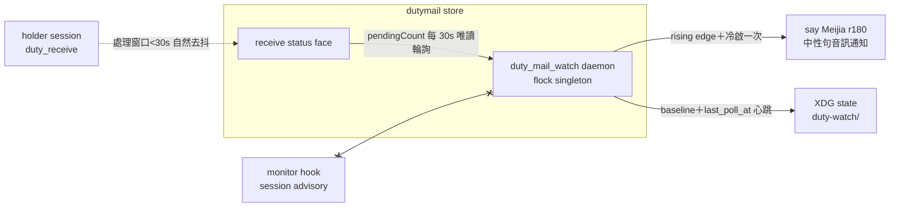

## Description

<!-- SECTION:DESCRIPTION:BEGIN -->
user 需求：一個 skill 級 watcher 自動查詢本 repo 有沒有 dutymail 來信（start/stop/status），無 session 活躍時以 macOS say 音訊通知人類，不引入值星 holder 概念。三顧問設計討論收斂（muse job-muwr72bx-jnyk7p＋codex job-muwr72ez-sibfsk＋GLM-5.3 裁決 2026-10-06）：資料源=receive status pendingCount 30s 輪詢（events/wait 退役理由同 monitor hook）；觸發=rising edge＋冷啟 pending>0 一次；watcher 不依賴 holder face（Q3 裁決採 codex——duty_receive 只在 prompt 邊界觸發，idle holder 正是本 watcher 要補的 gap；活躍 session 處理窗口 <30s 自然去抖）；載體=python daemon（flock singleton＋驗鎖不盲殺）；state=XDG state ai-guide/duty-watch/；say 中性句 Meijia r180（voice skill 開始通知先例，避免稱謂清單第三副本）；launchd 不做（YAGNI）。watcher 呼叫面收斂單 face 唯讀；交付：scripts/duty_mail_watch.py＋skills/mail-watch/SKILL.md＋契約同步兩處（voice-notification 第四通道行、dutymail-roundtrip 三線表 machine-level baseline 註記）＋tests。


<!-- SECTION:DESCRIPTION:END -->

## Acceptance Criteria
<!-- AC:BEGIN -->
- [x] #1 AC1 唯讀不變式：watcher 呼叫面只含 receive status（rg 結構證：無 bind/prepare/ack/send/send-face 呼叫）
- [x] #2 AC2 觸發語義：rising edge＋冷啟一次＋同值靜默——fixture 逐案例綠（tests/test_duty_mail_watch.py）
- [x] #3 AC3 監督契約：flock singleton 拒二啟＋stale 自動釋放＋status 帶 PID 活性與 last_poll_at 心跳
- [x] #4 AC4 契約同步：voice-notification 通道表第四通道行＋roundtrip 三線表 machine-level baseline 註記（rg 命中）
- [x] #5 AC5 手動 smoke：start→status 證活→stop 乾淨（真 CLI face 唯讀；macOS sleep/resume 行為記 skill）
<!-- AC:END -->

## Implementation Notes

<!-- SECTION:NOTES:BEGIN -->
## Tri-panel review verdict（GLM-5.3 judge，2026-10-06 深夜弧）

三腿：muse run1（job-muws8wyh）＋muse run2（CLI re-run）＋codex（CLI）＋5.3 自審。合併 11 findings（dedup 後）——**全採納、零不採納**：J-1 HIGH（start 誤報 ready——ready 改首輪 poll 完成＋順序對調）；J-2 MED（say 瞬時失敗永久消耗 edge——**EP amendment**：fail-soft 改 baseline 不前進下輪重試）；J-3 MED（grace<say timeout——SAY_TIMEOUT 5s＋GRACE 8s＋記載邊角）；J-4 MED（W9 不覆蓋 subprocess 面——stub 記 argv 斷言）；J-5 MED（W7 race——同 J-1 根修）；J-6 LOW（stop 清 pid）；J-7 LOW（label 截 8 字）；J-8 LOW（status 無 O_CREAT 探測）；J-9 LOW（早死重查鎖帶 PID）；J-10 LOW（status 印 last_round_failed）；J-11 LOW（smoke receipt 落卡——主 session）。被拒選項：無（11/11）。可逆性：全雙向門；J-2 語義變更方向＝寧重不漏對齊，revert 成本低。PENDING：無（face 掛死 30s 極端窗口＝known limitation 記載）。

## J-11 AC5 smoke receipt（修復後重跑，2026-10-06 深夜——主 session）

```
start  → [mail-watch] started（pid 18822；addresses ai-guide-marshal；interval 5s）exit 0
status → daemon：running（pid 18822；process alive）＋heartbeat：last_poll 2s 前（fresh）＋ai-guide-marshal：baseline=0 pending=0（live probe）exit 0
stop   → [mail-watch] stopped（pid 18822 退出；state.json 保留）exit 0
事後驗：state.json pid/started_at=None（J-6 清場）＋baseline 保留＋pgrep 零流浪 daemon
```

（初版 smoke＝11c6da9e 前實跑同形；修復後重跑如上。）

## 修復腿驗收（主 session 獨立重跑）

tests/test_duty_mail_watch.py 24 passed（18→24：新增 bad-config fail-before-ready／say retry 兩輪／persistent recover／long alias／fresh-dir zero residue／heartbeat mark）；全套 3383 passed 1 skipped；ruff clean；`rg "holder|prepare|\.ack\b|dutymail send"` 零命中；J-2 語義抽查（say_pending 在場 line 302）＋J-3 常數抽查（READY 10/GRACE 8/SAY 5）屬實。
<!-- SECTION:NOTES:END -->
