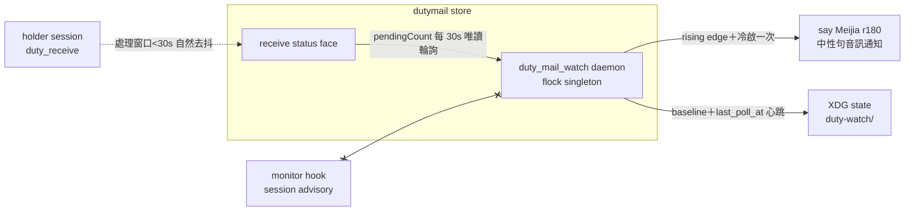

## Description

<!-- SECTION:DESCRIPTION:BEGIN -->
user 需求：一個 skill 級 watcher 自動查詢本 repo 有沒有 dutymail 來信（start/stop/status），無 session 活躍時以 macOS say 音訊通知人類，不引入值星 holder 概念。三顧問設計討論收斂（muse job-muwr72bx-jnyk7p＋codex job-muwr72ez-sibfsk＋GLM-5.3 裁決 2026-10-06）：資料源=receive status pendingCount 30s 輪詢（events/wait 退役理由同 monitor hook）；觸發=rising edge＋冷啟 pending>0 一次；watcher 不依賴 holder face（Q3 裁決採 codex——duty_receive 只在 prompt 邊界觸發，idle holder 正是本 watcher 要補的 gap；活躍 session 處理窗口 <30s 自然去抖）；載體=python daemon（flock singleton＋驗鎖不盲殺）；state=XDG state ai-guide/duty-watch/；say 中性句 Meijia r180（voice skill 開始通知先例，避免稱謂清單第三副本）；launchd 不做（YAGNI）。watcher 呼叫面收斂單 face 唯讀；交付：scripts/duty_mail_watch.py＋skills/mail-watch/SKILL.md＋契約同步兩處（voice-notification 第四通道行、dutymail-roundtrip 三線表 machine-level baseline 註記）＋tests。

<!-- SECTION:DESCRIPTION:END -->

## Acceptance Criteria
<!-- AC:BEGIN -->
- [ ] #1 AC1 唯讀不變式：watcher 呼叫面只含 receive status（rg 結構證：無 bind/prepare/ack/send/send-face 呼叫）
- [ ] #2 AC2 觸發語義：rising edge＋冷啟一次＋同值靜默——fixture 逐案例綠（tests/test_duty_mail_watch.py）
- [ ] #3 AC3 監督契約：flock singleton 拒二啟＋stale 自動釋放＋status 帶 PID 活性與 last_poll_at 心跳
- [ ] #4 AC4 契約同步：voice-notification 通道表第四通道行＋roundtrip 三線表 machine-level baseline 註記（rg 命中）
- [ ] #5 AC5 手動 smoke：start→status 證活→stop 乾淨（真 CLI face 唯讀；macOS sleep/resume 行為記 skill）
<!-- AC:END -->

## Implementation Notes

<!-- SECTION:NOTES:BEGIN -->
三顧問 verdict 物：muse Q1-Q5 agree／Q6 alternative（say 慣例對齊＋白名單補行）；codex Q1/Q2/Q5 agree／Q3 disagree（holder live≠有人收信——採納）／Q4 alternative（flock＋identity）／Q6 alternative（獨立通道中性句）。5.3 裁決：Q3 採 codex（呼叫面收斂單 face）；Q6 中性句調和（無稱謂清單第三副本）。design brief=.agent-tmp/mail-watch-design-brief.md；EP draft=.agent-tmp/mail-watch-ep-draft.md。
<!-- SECTION:NOTES:END -->
