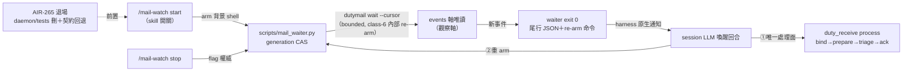
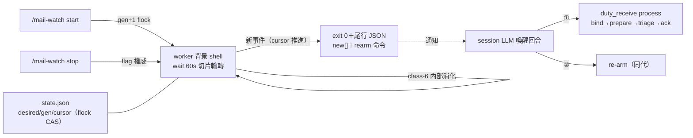

## Description

<!-- SECTION:DESCRIPTION:BEGIN -->
user 需求定調（2026-10-07 早上三輪收斂）：不用 daemon、不是 hook——定時輪詢、有信就觸發 LLM 處理，與 bg bridge/sub-agent 進度同本質（背景 shell exit＝唯一 push 原語）；Skill start/stop 開關；持續除非喊停（exit 後 LLM 於喚醒回合處理＋重 arm）；與 bridge waiter 統一為一份契約非兩套。tri 收斂（muse＋codex 兩顧問腿＋GLM-5.3 裁決，2026-10-07——job 證據指針見 Implementation Notes）：Q1 AIR-265 退場（刪 daemon script/tests、skill 名重用、voice 回三通道、roundtrip 註記改寫、索引同步、殘留清場）；Q2 契約文件化單一源（waiter 家族憲章）、mail_waiter 自含、_waiter_core 延後；Q3 state 落 desired/generation/armed_at/last_exit＋skill invariant（處理完成→成功 re-arm→才結束喚醒回合）；Q4 紅線零例外（waiter 純觀察軸、處理恆走 duty_receive、events cursor 禁觸 delivery cursor）；最大風險雙收——generation CAS 防雙 arm 併發、session-scoped 生命週期明示＋status staleness；coalesce 由 events cursor 推進天然保證。

<!-- SECTION:DESCRIPTION:END -->

## Acceptance Criteria
<!-- AC:BEGIN -->
- [x] #1 AC1 喚醒契約：信到→waiter exit 0（尾行 JSON：門牌×新事件數＋re-arm 命令）→duty_receive process 接手；waiter 全生命週期零 bind/prepare/ack/send 呼叫（rg＋allowlist 結構證）
- [x] #2 AC2 開關語義：start（arm）／stop（flag 權威——re-arm 遇 flag 即退回報 stopped）／status（desired/generation/armed_at/cursor/staleness）；session 級生命週期 skill 明示
- [x] #3 AC3 併發安全：generation token CAS——雙 arm 後舊 worker 自退、events cursor 不回退、stale worker 不覆蓋新 generation state
- [x] #4 AC4 typed-failure 四分流：wait-timeout（class-6）內部 re-arm 不外洩；storage/fencing 跳輪＋心跳標記；usage/admission fail-loud exit 2
- [x] #5 AC5 AIR-265 退場清場：duty_mail_watch.py＋其 tests 刪；voice-notification 回三通道；roundtrip machine-level 註記改寫指向本卡；skills/AGENTS.md 索引同步；rg 殘留引用零命中
- [x] #6 AC6 手動 smoke：start→exit 0 尾行 JSON→（處理）→re-arm→stop 乾淨（flag 生效回報 stopped）
<!-- AC:END -->

## Implementation Notes

<!-- SECTION:NOTES:BEGIN -->
## Tri-panel review verdict（GLM-5.3 judge，2026-10-07）

三腿：muse review face＋codex WO task face（review face 撞 28K 閘改自跑 git diff）＋5.3 自審（四 findings 親驗 code 屬實）。合併 8 findings——**全採納**：
J-1 HIGH（codex）真實 runner 30s timeout 殺 60s wait——fake-runner 遮蔽、真場 smoke 靠運氣未曝；修＝waiter 專用 runner（timeout>deadline）＋TimeoutExpired 歸 skip-round fail-soft。
J-2 HIGH（codex）generation CAS＝TOCTOU（load→check→save 無鎖；測試把 race 排在 guard load 前＝沒測到真 race）；修＝flock critical section（compare+write＋start increment 同一原子邊界）。
J-3 HIGH（muse+codex 同發）coalesce 只掃觸發後段 addresses[index+1:]；修＝snapshot 全部 other。
J-4 HIGH（muse）非空頁無 nextCursor 靜默 cursor 歸 null→冷啟重掃；修＝shape-drift fail-loud。
J-5 MED（muse）stopped 先於 generation 檢查→stale worker 誤標 stopped；修＝generation 先查。
J-6 MED（muse）snapshot usage raise 丟已找到 mail 報告（持續壞配置→主門牌永不醒）；J-7 MED（codex）snapshot class4/5 靜默無 round_failed——合併修＝snapshot 全容忍（一切 typed failure→round_failed=True、不 raise），fail-loud 只在主 watch 路徑。
J-8 MED（muse）AC5/AC6 收據落卡＝結案時主 session 補。
被拒：無（8/8）。可逆性：全雙向。最大教訓＝J-1：fake-runner 測試面加真 subprocess timeout 案例釘住。

## 修復腿驗收＋AC5/AC6 收據（J-8；主 session 2026-10-07）

- **修復驗收**：tests/test_mail_waiter.py **30 passed**（23＋7 新：J-1 真子進程逾時 stub／J-2 並發 50 交錯一致性（RED 期真炸 FileNotFoundError lost-update）／J-3 前段快照／J-4 ×2 shape-drift fail-loud／J-5 superseded 先序／J-6+7 snapshot 全容忍）；全套 **3392 passed 1 skipped**；ruff clean；`rg "bind|prepare|\.ack\b|dutymail send"` 零命中。
- **AC6 smoke（修復前 1ca8e5cc 基底）**：start→冷啟喚醒（全量 73 events，寧重不漏）→duty_receive process→re-arm→真信（air266-ac6-smoke-001）→**count=1 精準喚醒**（cursor 推進 coalesce）→process（patrol surface）→stop flag→status 五欄（desired=stopped/cursor=74/last_exit=mail）。
- **AC6 smoke（修復後）**：start（gen2）→真實 wait 週期→count=4 喚醒（他 session holder 活動事件）→stop 生效。**邊界如實記**：純 60s 無信 timeout 路徑未在真 store 踩到（事件先到）——由 `test_j1_runner_timeout_skip_round_real_stub`（真子進程真逾時：睡 5s/timeout 3s→skip 續輪→事件到 exit 0）釘住。
- **AC5 清場收執**：`rg -l duty_mail_watch` 工作面零命中（僅卡面歷史）；voice 回三通道 rg 零命中；機器本地 `~/.local/state/ai-guide/duty-watch/` 已刪（S3 命令執行收執）。
<!-- SECTION:NOTES:END -->

## Final Summary
<!-- SECTION:FINAL_SUMMARY:BEGIN -->
**交付**：session 級信件喚醒 watcher——`scripts/mail_waiter.py`（start/stop/status＋內部 worker；wait/events 唯讀雙 face、generation flock CAS、typed-failure 四分流、TimeoutExpired fail-soft、尾行 JSON 喚醒契約＋re-arm 命令）＋`skills/mail-watch/SKILL.md` 重寫（開關用法＋喚醒回合 invariant＋waiter 家族憲章＋session 生命週期明示）＋`tests/test_mail_waiter.py`（30 案例）＋AIR-265 daemon 全退場（刪 script/tests、voice 回三通道、roundtrip/索引改寫、機器本地 state 清）。

**管線**（user 指定全序）：tri（muse＋codex＋5.3——liveness/契約/生命週期四題裁決）→EP（8ef21184）→WT flash 實作（1ca8e5cc）→tri-panel 四腿（muse review＋codex WO task face〔review face 撞 28K 閘的階梯處理〕＋5.3 親驗）→judge 8/8 採納（1001f525）→修復 J-1..J-7（真子進程 timeout/flock CAS/coalesce 全段/shape-drift fail-loud/順序/snapshot 全容忍）→smoke×2→結案。

**驗證**：30 tests＋全套 3392 綠；rg 紅線零命中×2；真 store smoke 兩輪（冷啟 73→精準 1→事件 4；stop flag×2）；AC5 殘留零命中。

**known limitations**：純 idle timeout 真場未踩（由真子進程 stub 測試覆蓋）；events 軸計入 holder 活動事件（bound/prepared/acked）——喚醒計數含非信件事件，屬觀察軸語義（有事件≠有信，處理面 duty_receive 自行分診 pending）。

<!-- SECTION:FINAL_SUMMARY:END -->

## Plan
<!-- SECTION:PLAN:BEGIN -->
1. S1+S4 TDD：mail_waiter 核心＋tests（TC-W1..W9）
2. S2 skill 重寫（mail-watch 開關語義＋家族憲章）
3. S3 AIR-265 退場清場
4. tri-panel→judge→修復→smoke→結案
（EP＝ai-analysis/_tasks/10-07-mail-waiter/ep.md；amendment 見該檔尾行）
<!-- SECTION:PLAN:END -->
