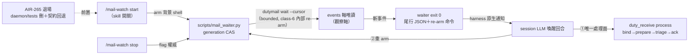

## Description

<!-- SECTION:DESCRIPTION:BEGIN -->
user 需求定調（2026-10-07 早上三輪收斂）：不用 daemon、不是 hook——定時輪詢、有信就觸發 LLM 處理，與 bg bridge/sub-agent 進度同本質（背景 shell exit＝唯一 push 原語）；Skill start/stop 開關；持續除非喊停（exit 後 LLM 於喚醒回合處理＋重 arm）；與 bridge waiter 統一為一份契約非兩套。tri 收斂（muse＋codex 兩顧問腿＋GLM-5.3 裁決，2026-10-07——job 證據指針見 Implementation Notes）：Q1 AIR-265 退場（刪 daemon script/tests、skill 名重用、voice 回三通道、roundtrip 註記改寫、索引同步、殘留清場）；Q2 契約文件化單一源（waiter 家族憲章）、mail_waiter 自含、_waiter_core 延後；Q3 state 落 desired/generation/armed_at/last_exit＋skill invariant（處理完成→成功 re-arm→才結束喚醒回合）；Q4 紅線零例外（waiter 純觀察軸、處理恆走 duty_receive、events cursor 禁觸 delivery cursor）；最大風險雙收——generation CAS 防雙 arm 併發、session-scoped 生命週期明示＋status staleness；coalesce 由 events cursor 推進天然保證。

<!-- SECTION:DESCRIPTION:END -->

## Acceptance Criteria
<!-- AC:BEGIN -->
- [ ] #1 AC1 喚醒契約：信到→waiter exit 0（尾行 JSON：門牌×新事件數＋re-arm 命令）→duty_receive process 接手；waiter 全生命週期零 bind/prepare/ack/send 呼叫（rg＋allowlist 結構證）
- [ ] #2 AC2 開關語義：start（arm）／stop（flag 權威——re-arm 遇 flag 即退回報 stopped）／status（desired/generation/armed_at/cursor/staleness）；session 級生命週期 skill 明示
- [ ] #3 AC3 併發安全：generation token CAS——雙 arm 後舊 worker 自退、events cursor 不回退、stale worker 不覆蓋新 generation state
- [ ] #4 AC4 typed-failure 四分流：wait-timeout（class-6）內部 re-arm 不外洩；storage/fencing 跳輪＋心跳標記；usage/admission fail-loud exit 2
- [ ] #5 AC5 AIR-265 退場清場：duty_mail_watch.py＋其 tests 刪；voice-notification 回三通道；roundtrip machine-level 註記改寫指向本卡；skills/AGENTS.md 索引同步；rg 殘留引用零命中
- [ ] #6 AC6 手動 smoke：start→exit 0 尾行 JSON→（處理）→re-arm→stop 乾淨（flag 生效回報 stopped）
<!-- AC:END -->

## Implementation Notes

<!-- SECTION:NOTES:BEGIN -->
tri verdict 全文：muse job-mux6l3zj-7d10b8＋codex job-mux6l413-qsdwof（2026-10-07）。5.3 裁決：Q2 折中（契約文件化＋自含實作＋core 延後）；Q3 採 codex 加強版 state schema；coalesce=cursor 推進天然（muse 漏看面解法）。brief=.agent-tmp/mail-waiter-brief.md。前置研究腿：waiter 家族喚醒鏈實證（bridge_waiter T1-T9/harness_waiter/dutymail wait class-6=124 等價）。
<!-- SECTION:NOTES:END -->
