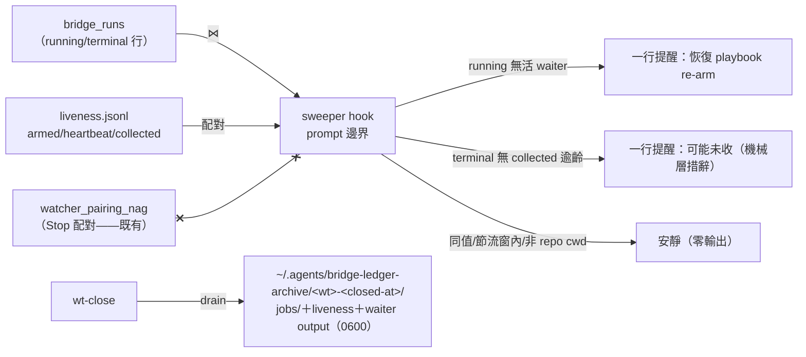

## Description

<!-- SECTION:DESCRIPTION:BEGIN -->
user 裁決（2026-10-07）：「sweeper＋sidecar 標記做 ai-guide 側，WT drain 做 wt-close 小修，bridge 側 consume 標記面順手加進批次⑥後續信」——tri 後老規矩實作。tri 三方收斂（muse＋codex 兩顧問腿＋GLM-5.3 裁決）：①sweeper＝duty 家族 prompt 邊界 hook（SessionStart 全掃＋UserPromptSubmit 節流 90s＋session-local baseline 值變化才出聲＋cwd eligibility＋fail-soft exit 恆 0）；②在場判據不用 pgrep（跨 session false-covered——muse 最大風險）——消費既有 liveness.jsonl 台帳（armed/heartbeat/collected 配對）⋈ bridge_runs terminal 行；③側車不做（liveness collected 事件已機器側寫入，零新增 LLM 紀律）；語義分層（codex）——sweeper 只報機械層「可能未收」，不宣稱 session 已驗收；④WT drain（wt-close 小修）歸檔 .delegate-bridge/jobs/＋liveness.jsonl＋waiter output → machine-local 防碰撞命名 0600、v1 無 TTL；⑤D（bridge 原生 retrieved_at/exported_at）併批次⑥後續信、不阻塞本卡；out of scope＝reconcile 變異（waiter T7 擁有）與 worker-無-ledger-行（無可靠 identity）。owner 分工（muse 漏看面）：sweeper=prompt 邊界提醒；watcher_pairing_nag=Stop 配對；liveness=waiter 自有；機械真相源=liveness 台帳。

<!-- SECTION:DESCRIPTION:END -->

## Acceptance Criteria
<!-- AC:BEGIN -->
- [ ] #1 AC1 sweeper 偵測兩態：running 行無活 armed/heartbeat→提醒 re-arm；terminal 行無 collected 且逾齡→提醒收線（fixture 逐案例綠）
- [ ] #2 AC2 節流與安靜：SessionStart 全掃＋PromptSubmit 90s 節流＋baseline 值變化才出聲＋cwd gate＋fail-soft（face 失敗零 stdout）＋exit 恆 0
- [ ] #3 AC3 語義分層：輸出恆為「可能未收」機械層措辭，零 session-驗收宣稱（文檔＋測試釘）
- [ ] #4 AC4 WT drain：wt-close 歸檔 jobs/＋liveness.jsonl＋waiter output 至 ~/.agents/bridge-ledger-archive/<wt>-<closed-at>/（0600、防碰撞）——wt-close preflight/全跑綠
- [ ] #5 AC5 手動 smoke：真 liveness＋runs 現場跑一輪 sweeper（乾淨＝安靜；注入孤兒 fixture＝一行提醒）＋wt-close drain 演練收執
<!-- AC:END -->

## Implementation Notes

<!-- SECTION:NOTES:BEGIN -->
tri verdict：muse（pgrep false-covered 最大風險/liveness 配對正解/節流先例 duty_mailbox_monitor/reconcile 不蓋）＋codex（語義分層 retrieved_at/SessionStart+60-120s 節流/WT drain 帶證據鏈/worker-無行不納入）；5.3 裁決全採納——B 側車撤（liveness 已存在實證 132KB 台帳）。brief=.agent-tmp/bridge-sweeper-brief.md。
<!-- SECTION:NOTES:END -->
