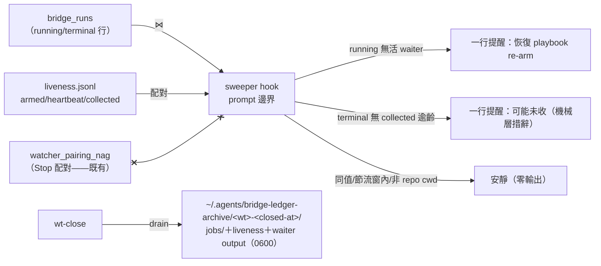
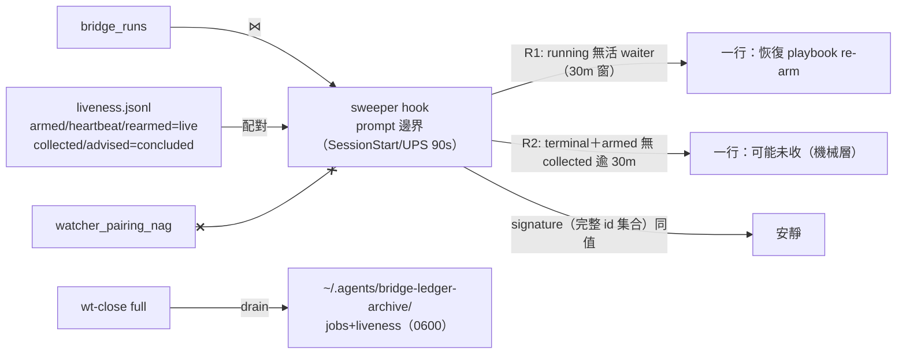

## Description

<!-- SECTION:DESCRIPTION:BEGIN -->
user 裁決（2026-10-07）：「sweeper＋sidecar 標記做 ai-guide 側，WT drain 做 wt-close 小修，bridge 側 consume 標記面順手加進批次⑥後續信」——tri 後老規矩實作。tri 三方收斂（muse＋codex 兩顧問腿＋GLM-5.3 裁決）：①sweeper＝duty 家族 prompt 邊界 hook（SessionStart 全掃＋UserPromptSubmit 節流 90s＋session-local baseline 值變化才出聲＋cwd eligibility＋fail-soft exit 恆 0）；②在場判據不用 pgrep（跨 session false-covered——muse 最大風險）——消費既有 liveness.jsonl 台帳（armed/heartbeat/collected 配對）⋈ bridge_runs terminal 行；③側車不做（liveness collected 事件已機器側寫入，零新增 LLM 紀律）；語義分層（codex）——sweeper 只報機械層「可能未收」，不宣稱 session 已驗收；④WT drain（wt-close 小修）歸檔 .delegate-bridge/jobs/＋liveness.jsonl＋waiter output → machine-local 防碰撞命名 0600、v1 無 TTL；⑤D（bridge 原生 retrieved_at/exported_at）併批次⑥後續信、不阻塞本卡；out of scope＝reconcile 變異（waiter T7 擁有）與 worker-無-ledger-行（無可靠 identity）。owner 分工（muse 漏看面）：sweeper=prompt 邊界提醒；watcher_pairing_nag=Stop 配對；liveness=waiter 自有；機械真相源=liveness 台帳。

<!-- SECTION:DESCRIPTION:END -->

## Acceptance Criteria
<!-- AC:BEGIN -->
- [x] #1 AC1 sweeper 偵測兩態：running 行無活 armed/heartbeat→提醒 re-arm；terminal 行無 collected 且逾齡→提醒收線（fixture 逐案例綠）
- [x] #2 AC2 節流與安靜：SessionStart 全掃＋PromptSubmit 90s 節流＋baseline 值變化才出聲＋cwd gate＋fail-soft（face 失敗零 stdout）＋exit 恆 0
- [x] #3 AC3 語義分層：輸出恆為「可能未收」機械層措辭，零 session-驗收宣稱（文檔＋測試釘）
- [x] #4 AC4 WT drain：wt-close 歸檔 jobs/＋liveness.jsonl＋waiter output 至 ~/.agents/bridge-ledger-archive/<wt>-<closed-at>/（0600、防碰撞）——wt-close preflight/全跑綠
- [x] #5 AC5 手動 smoke：真 liveness＋runs 現場跑一輪 sweeper（乾淨＝安靜；注入孤兒 fixture＝一行提醒）＋wt-close drain 演練收執
<!-- AC:END -->

## Implementation Notes

<!-- SECTION:NOTES:BEGIN -->
## Tri-panel review verdict（GLM-5.3 judge，2026-10-07）

三腿：muse review face＋codex WO task face＋5.3 自審（R2 洪水已於 smoke 期自抓自修：無 armed 痕跡安靜——578→5 真孤兒實證）。合併 7 findings——**全採納**：
J-1 MED（muse）runs JSON contract 只由 fake 斷言——真樣本 frozen fixture 釘（bridge schema 變更防靜默死）。
J-2 MED（muse）R2 armed 前提未同步 EP 表/skill 段（doc drift）。
J-3 LOW（muse）hook 核心 import 在 fail-soft 邊界外——移入 run() try 內。
J-4 HIGH（codex）15m freshness 違反 waiter 20m 合法輪詢契約（death threshold 30m 刻意＞T_GROW_CAP）——假孤兒+重複 arm 風險；修＝floor 30m 鏡像＋16-20m healthy 回歸釘。
J-5 HIGH（codex）advisory（完結事件）被算活心跳——stall 後 running 行誤判有活 waiter 到窗期末；修＝live ts（armed/heartbeat/rearmed）與 concluded（collected/advised）分離。
J-6 HIGH（codex）signature 對顯示文字（count+前3）非完整集合——尾部交換漏報/順序假變化；修＝排序完整 {r1,r2} id 集合簽章、顯示層才截。
J-7 MED（codex）ZCode host 10s timeout < 內層 bridge 30s——fail-soft catch 來不及跑；修＝內層 timeout 8s 並釘關係。
被拒：無（7/7）。可逆性：全雙向。

## 修復腿驗收＋AC5 收據（主 session 2026-10-07）

- **驗收**：tests/test_bridge_sweeper.py **45 passed**（35＋10 新）；全套 **3437 passed 1 skipped**；ruff clean；`bash -n wt-close.sh`＋pgrep/Popen 零命中；py39 compile 硬約束過（hooks 面）。
- **AC5 smoke（修復前後各一輪，真 liveness＋真 runs）**：修復前首掃＝578 行洪水（R2 無 armed 痕跡全報）→5.3 自修（armed 前提）→**5 個真孤兒**（09-26 晨批「收信教學」tri verdicts——waiter 亡故 collected 未落；內容已透過 AIR-263 落地，無需補動作，處置＝本行記錄）；修復後複掃＝同一 5 個一行提醒、signature 去重生效。孤兒注入 fixture 案例綠（scan_once 純函式直驗）。
- **drain 演練**：實作腿 L4 真跑（preflight report-only＋full 歸檔 0600）＋TC-S8 整合（真 bash wt-close 兩面）；歸檔位置 `~/.agents/bridge-ledger-archive/`（env 可注入——測試零真觸碰）。
- **live 安裝**：註冊模板（zcode.json 兩 boundary＋manifest）已落；live config 部署＋新 session 接線驗證＝收線後 marshal 執行（hooks/AGENTS.md 慣例）。
<!-- SECTION:NOTES:END -->

## Final Summary
<!-- SECTION:FINAL_SUMMARY:BEGIN -->
**交付**：bridge 收線 backstop 三件——`scripts/bridge_sweeper.py`＋`hooks/bridge_ledger_sweeper.py`（prompt 邊界 hook：R1 孤兒 running/R2 terminal 可能未收——liveness armed−collected 配對、30m freshness（對齊 waiter 20m 合法輪詢＋30m death threshold）、90s 節流＋完整集合 signature 去重、8s 內層 timeout<host 10s、「可能未收」語義分層、fail-soft 恆 0）＋wt-close drain（WT bridge 證據歸檔 machine-local、防碰撞 0600）＋安裝註冊面（zcode.json/manifest/monitor topology 釘測同步）＋45 tests（含真 runs frozen fixture 契約釘）。

**管線**：tri（muse＋codex＋5.3——pgrep 否決/liveness 復用/語義分層/owner 分工）→EP（f36efe16）→flash 實作（7a212059＋5.3 期 R2 洪水自修）→tri-panel（muse 3＋codex 4）→judge 7/7（83149d38）→修復（freshness 30m/advisory 完結事件分離/完整集合 signature/timeout 階梯/契約 fixture 釘/import 邊界/doc 同步）→smoke 複跑→結案。

**首戰實績**：第一次真場掃描即抓到 **5 個真歷史孤兒**（09-26 晨批 tri verdicts，waiter 亡故未收——user 早上懷疑的「做完沒回報」實體）；R2 洪水（578 誤報）在 smoke 期自抓自修。

**known limitations**：手動收線（bridge_show 直呼）不落 collected 事件——R2 baseline 去重吸收噪音，長期解＝bridge 原生 retrieved_at（批次⑥後續信）；failed-\* terminal 不提醒（v1 收窄）；cc.json dormant 模板未加（退役面）。

<!-- SECTION:FINAL_SUMMARY:END -->

## Plan
<!-- SECTION:PLAN:BEGIN -->
1. S1+S3 TDD：sweeper 核心＋hook 前導＋tests（TC-S1..S8）
2. S2 wt-close drain（preflight report-only/full 歸檔）
3. S4 安裝註冊＋文檔（zcode.json/manifest/skill 家族分工）
4. tri-panel→judge→修復 J1-J7→smoke→結案
（EP＝ai-analysis/_tasks/10-07-bridge-sweeper/ep.md；amendment 兩行見該檔）
<!-- SECTION:PLAN:END -->
