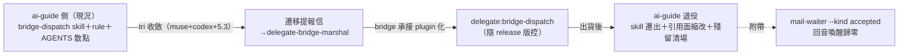

## Description

<!-- SECTION:DESCRIPTION:BEGIN -->
user 裁決（2026-10-07）：「bridge 相關的 skill 應該搬到 bridge repo——他是 plugin 可以裝 skill，讓他自己處理比較好；跟 muse codex 討論後看怎樣寄信；ai-guide 側開卡準備退役這邊的 skills」。動機：skill 文本與 CLI 版本 drift（3.2.1→3.4.0 間多處 as-of 過時）、跨 repo 雙重維護（今日 provision 契約三處追趕實例）、plugin skills 先例已存在（delegate:delegate-runtime 等）。流程：tri（muse+codex+5.3，進行中）→收斂後寄遷移提報信給 delegate-bridge-marshal→bridge 側承接 plugin 化→ai-guide 側退役（skill 遷出/縮為 pointer/rule 最小核心去留依 tri）→殘留引用清場。另附帶 mail-waiter kind filter 修正（--kind accepted 消外箱/自家處理波回音喚醒——掛本卡或獨立小卡依 tri Q5）。

<!-- SECTION:DESCRIPTION:END -->

## Acceptance Criteria
<!-- AC:BEGIN -->
- [ ] #1 AC1 tri 三方收斂＋遷移提報信寄出（bridge 側承接確認前不動本地）
- [ ] #2 AC2 bridge 側 plugin skill 出貨後：ai-guide 側退役落地（skill 遷出＋rule/AGENTS.md 引用面縮改＋rg 殘留清場）
- [ ] #3 AC3 mail-waiter kind filter 修正落地（--kind accepted；回音喚醒歸零實測）
<!-- AC:END -->

## Implementation Notes

<!-- SECTION:NOTES:BEGIN -->
外側狀態（2026-10-07 上午）：bridge db-91（wait kind 過濾——user 升級馬上做，形①=--kind 旗標＋waiter scope kind；出貨後本卡 watcher 做 simplify amendment 回單跳）；db-92（skill 遷移 plugin 化——In Progress，user 強化裁定 bridge ship 自己的 skills）。AC2 退役段 standby 等 db-92 出貨通知→四 harness consumer 驗收→退役本地。
<!-- SECTION:NOTES:END -->
