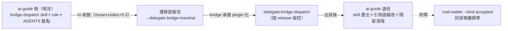

## Description

<!-- SECTION:DESCRIPTION:BEGIN -->
user 裁決（2026-10-07）：「bridge 相關的 skill 應該搬到 bridge repo——他是 plugin 可以裝 skill，讓他自己處理比較好；跟 muse codex 討論後看怎樣寄信；ai-guide 側開卡準備退役這邊的 skills」。動機：skill 文本與 CLI 版本 drift（3.2.1→3.4.0 間多處 as-of 過時）、跨 repo 雙重維護（今日 provision 契約三處追趕實例）、plugin skills 先例已存在（delegate:delegate-runtime 等）。流程：tri（muse+codex+5.3，進行中）→收斂後寄遷移提報信給 delegate-bridge-marshal→bridge 側承接 plugin 化→ai-guide 側退役（skill 遷出/縮為 pointer/rule 最小核心去留依 tri）→殘留引用清場。另附帶 mail-waiter kind filter 修正（--kind accepted 消外箱/自家處理波回音喚醒——掛本卡或獨立小卡依 tri Q5）。

<!-- SECTION:DESCRIPTION:END -->

## Acceptance Criteria
<!-- AC:BEGIN -->
- [ ] #1 AC1 tri 三方收斂＋遷移提報信寄出（bridge 側承接確認前不動本地）
- [ ] #2 AC2 bridge 側 plugin skill 出貨後：ai-guide 側退役落地（skill 遷出＋rule/AGENTS.md 引用面縮改＋rg 殘留清場）
- [ ] #3 AC3 mail-waiter kind filter 修正落地（--kind accepted；回音喚醒歸零實測）
<!-- AC:END -->

## Implementation Notes

<!-- SECTION:NOTES:BEGIN -->
## tri verdict（GLM-5.3 裁決，2026-10-07）

兩腿（muse job-muxd1k7e＋codex job-muxd1k8z）收斂＋互補：Q1 三層切分（bridge-native 操作知識→plugin；always-on bootstrap 核心留 ai-guide rule 薄 pointer——plugin skill on-demand 扛不住首決策 gate；consumer governance（structural-evidence/cr-query/waiter 家族）留不搬）；Q2 雙 agree（隨 release 凍結＋易漂移數值改 runtime 查證）；Q3 採 codex projection（muse caller kit＝canonical 生成，非人工副本）；Q4 信帶 ownership map＋兩段式 migration gate（plugin 出貨驗 consumer→才退役）；Q5 雙 agree＝AIR-266 amendment＋裁決深化（--kind accepted 先落消處理波；外箱 accepted 若實測仍擾→direction predicate；投遞閉環訊號留 status 不喚醒）。雙最大風險同指向雙 owner 過渡 silent drift→gate 化＋退役驗收 rg 零命中＋fresh-session/upgrade/rollback 矩陣（codex 漏看面）。提報信 air-skill-migration-proposal-001 已寄 delegate-bridge-marshal。

db-92 phase① 出貨到貨（2026-10-07 11:0X，envelope db92-shipment-341-001 acceptanceSeq 20；3.4.1 plugin 內 delegate:bridge-dispatch skill、bridge 側 AC 全勾）——AC2 驗收觸發。驗收輸入＝bridge BUILD-REPORT migration gate 三探針矩陣（fresh-session discovery／upgrade／rollback，db-92 WT .agent-tmp/wo-db92-skill-v2.md）。驗收程序＝四 harness consumer 實測→通過才退役本地 skill（縮 pointer＋rg 殘留清零）→結案。同時在飛：AIR-269/270 兩卡（sitrep skill＋handoff 修訂）已 post-build 收斂待 commit（各卡 branch air-269/air-270，帳本 converged、receipt 落盤）；另承諾 10-08 EOD 前完成 bridge db807 協調信三面（Claude-hooks/discovery/G5，回信 air-ai-guide-cutover-ack-eta-001）。duty holder：本班 epoch 62。接手建議：本班 context 已深，AC2 驗收弧建議 fresh session 承接（讀本 notes＋db-92 卡 BUILD-REPORT 矩陣即自足）

AC2 驗收狀態：runner 12 腿全綠→bi 複核分歧（muse approve／codex hold 4 紅）→GLM-5.3 judge job-muxmfzik-g3irvg 終審＝**HOLD 退役暫緩**：Muse-a/b 紅（muse surface 抖動——runner 12:26 綠、codex 12:4X 拒、judge 12:46 全拒；安裝後非同步 retention 掃描，即時綠≠穩態）；ZCode-c/CC-c 維持綠（judge 裁功能讀法：rollback 節 never re-enabling 以 copies 在盤為預設，實體 prune 非 gate 條件）。根因鏈（judge 親驗）：bridge release session 漏 commit source manifest bump（committed 3.4.0、工作樹 3.4.1 未提交）→ muse staged/installed 3.4.0 → upgrade-consistency 對 3.4.1 從未行使。修復清單：①bridge-side commit bump（判準：git show HEAD 兩 manifest=3.4.1、porcelain plugins/delegate 空）②ai-guide：commit 後重 stage+install+catalog 驗 ③穩定性複探（裝後 ≥10min 再探，新判準）④retention 根因追蹤（復發才升級）⑤bridge 非阻斷（矩陣措辭改 no stale reference/no shadow＋清 staging 殘留）⑥harness prune 無須動。重跑範圍＝Muse 三腿，其餘九腿成立。已寄 bridge 通知信（in-reply-to db92-shipment-341-001）。持章：本班 epoch 62

修復進度：bridge 側 ①⑤ 秒辦（0e5b88e commit bump＋a1ebac7 矩陣措辭 no-stale-reference＋runbook 教訓行——直接引用本驗收抓漏）；通知信 db92-341-manifest-fix-001 已收。ai-guide ② 完成：從 primary main @a1ebac7 重 stage（manifest 3.4.1 ✓）→ muse plugins install --scope user（delegate 3.4.1 enabled，cache 4bd22cb2）→ catalog 列 bridge-dispatch、零 retention 拒絕。③ 穩定性複探計時器掛起（≥10min 後再探，judge 新判準）。下一步：③ 過 → 重跑 Muse a/b/c → gate 重審 → 退役本地 skill（post-build 全鏈）→ 結案

gate 重審通過（2026-10-07 12:5X-13:06，證據補落）：bridge ①commit bump 0e5b88e＋⑤措辭/runbook a1ebac7 已落地（git show HEAD 兩 manifest=3.4.1、porcelain 空——judge 判準①過）；ai-guide ②從 primary main @a1ebac7 重 stage（manifest 3.4.1）→ muse plugins install --scope user（delegate 3.4.1 enabled，cache 4bd22cb2）；③穩定性複探 10.5min 後 3.4.1 穩定在列、零 retention（judge 新判準過）；④retention 未復發＝根因記錄 muse 側未決。Muse 三腿重跑：a＝fresh headless muse exec 100 skills 載入並列出 plugin:delegate:bridge-dispatch（exit 0）；b＝staged/installed 3.4.1、installed cache ≡ staged 全等、staged vs source 僅三 sanctioned 差異；c＝重 stage 零 delta＋prose 恰一份。gate 重審＝12/12（九腿照舊成立＋Muse 三腿新基準重驗綠）——**兩段式 gate 過，退役解禁**。退役 diff 已派 bi 複核（muxo02j2/muxo02l8，雙 reject 四項小修：doctrine 測試錨點同步/rule 懸空節名/grok 雙 owner 縮指針/一字還原——修正迴圈進行中）
<!-- SECTION:NOTES:END -->
