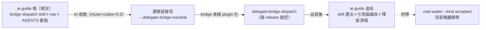

## Description

<!-- SECTION:DESCRIPTION:BEGIN -->
user 裁決（2026-10-07）：「bridge 相關的 skill 應該搬到 bridge repo——他是 plugin 可以裝 skill，讓他自己處理比較好；跟 muse codex 討論後看怎樣寄信；ai-guide 側開卡準備退役這邊的 skills」。動機：skill 文本與 CLI 版本 drift（3.2.1→3.4.0 間多處 as-of 過時）、跨 repo 雙重維護（今日 provision 契約三處追趕實例）、plugin skills 先例已存在（delegate:delegate-runtime 等）。流程：tri（muse+codex+5.3，進行中）→收斂後寄遷移提報信給 delegate-bridge-marshal→bridge 側承接 plugin 化→ai-guide 側退役（skill 遷出/縮為 pointer/rule 最小核心去留依 tri）→殘留引用清場。另附帶 mail-waiter kind filter 修正（--kind accepted 消外箱/自家處理波回音喚醒——掛本卡或獨立小卡依 tri Q5）。

<!-- SECTION:DESCRIPTION:END -->

## Acceptance Criteria
<!-- AC:BEGIN -->
- [ ] #1 AC1 tri 三方收斂＋遷移提報信寄出（bridge 側承接確認前不動本地）
- [ ] #2 AC2 bridge 側 plugin skill 出貨後：ai-guide 側退役落地（skill 遷出＋rule/AGENTS.md 引用面縮改＋rg 殘留清場）
- [ ] #3 AC3 mail-waiter kind filter 修正落地（--kind accepted；回音喚醒歸零實測）
<!-- AC:END -->

## Implementation Notes

<!-- SECTION:NOTES:BEGIN -->
## tri verdict（GLM-5.3 裁決，2026-10-07）

兩腿（muse job-muxd1k7e＋codex job-muxd1k8z）收斂＋互補：Q1 三層切分（bridge-native 操作知識→plugin；always-on bootstrap 核心留 ai-guide rule 薄 pointer——plugin skill on-demand 扛不住首決策 gate；consumer governance（structural-evidence/cr-query/waiter 家族）留不搬）；Q2 雙 agree（隨 release 凍結＋易漂移數值改 runtime 查證）；Q3 採 codex projection（muse caller kit＝canonical 生成，非人工副本）；Q4 信帶 ownership map＋兩段式 migration gate（plugin 出貨驗 consumer→才退役）；Q5 雙 agree＝AIR-266 amendment＋裁決深化（--kind accepted 先落消處理波；外箱 accepted 若實測仍擾→direction predicate；投遞閉環訊號留 status 不喚醒）。雙最大風險同指向雙 owner 過渡 silent drift→gate 化＋退役驗收 rg 零命中＋fresh-session/upgrade/rollback 矩陣（codex 漏看面）。提報信 air-skill-migration-proposal-001 已寄 delegate-bridge-marshal。
<!-- SECTION:NOTES:END -->
