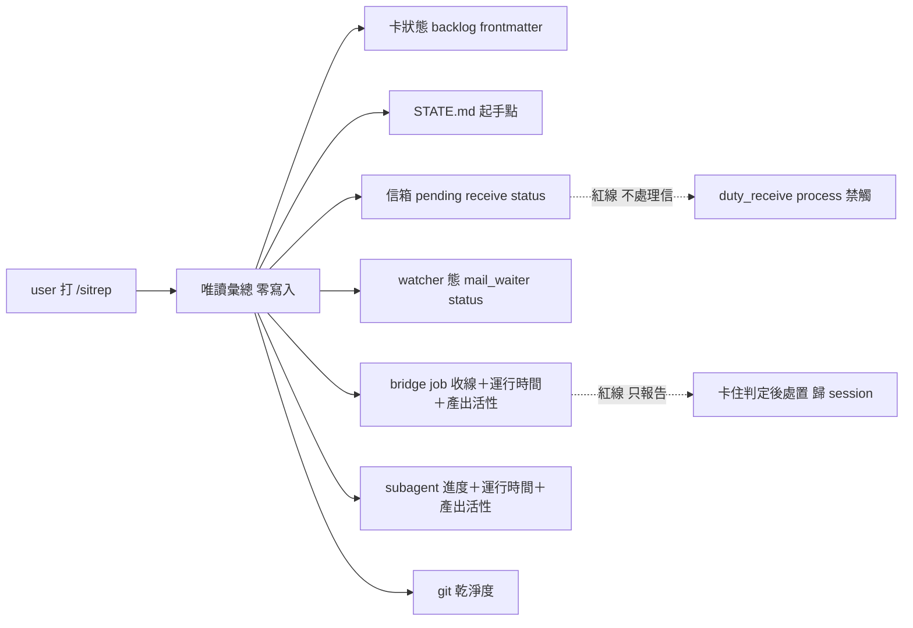

## Description

<!-- SECTION:DESCRIPTION:BEGIN -->
值星 session 打 `/sitrep` 一次看全況：現在做到哪、信箱有沒有信、watcher 活著嗎、bridge job／spawn 出去的 subagent 有沒有在動、做完有沒有回來說。純唯讀——只看不動。

**做什麼**：七面各一行、異常才展開——①active 卡狀態 ②STATE.md 起手點 ③信箱 pending ④watcher 態 ⑤bridge job 收線態 ⑥spawn subagent 進度 ⑦git 乾淨度。⑤⑥ 兩面都要帶**運行時間＋產出活性**（最後活動距今、產出是否还在增長）——因為 sub／bridge 工作有時會真的卡住，或做完了卻沒回報（terminal 未收／靜默完成都要現形）。
**不做什麼**：不處理信（duty_receive process 是 holder-gated 另一條鏈）、不 re-arm watcher、不收線 job、不 kill 卡住的 sub（只報告，處置歸 session 判斷）、不 commit。
**分工**：standup＝昨日回顧、sitrep＝現在快照；state-review＝深審；本 skill 是多面彙總的消費端，呼叫各機制既有唯讀面（mail_waiter status、agent_liveness_sweep、dutymail receive status、subagent 轉錄活性掃描），不重刻。

<!-- SECTION:DESCRIPTION:END -->

## Acceptance Criteria
<!-- AC:BEGIN -->
- [ ] #1 AC1 /sitrep 觸發輸出七面各一行，異常面才展開
- [ ] #2 AC2 每個資料面引用的命令實跑可過（機械來源驗證，附輸出）
- [ ] #3 AC3 紅線節在場——唯讀宣告＋不處置清單（信/watcher/job/sub 四項）
- [ ] #4 AC4 bridge 與 subagent 兩面帶運行時間＋產出活性（最後活動距今＋增長趨勢），terminal 未收／靜默完成會現形
- [ ] #5 AC5 skills/AGENTS.md 索引行在場
- [ ] #6 AC6 frontmatter desc 值 ≤1024 chars（scripts/scan_skills_desc.py 過）
- [ ] #7 AC7 muse+codex 審查無 blocker（落地前審查閘）
<!-- AC:END -->

## Implementation Plan

<!-- SECTION:PLAN:BEGIN -->
〔baseline：ai-guide 3a5c7712〕
〔已決策勿重辯：①名字＝sitrep（user 委任選名；B 線調研全域撞名零命中；watch/pulse/duty/status 已否決）②唯讀紅線——不處理信（duty_receive process 為 holder-gated 另一鏈）、不 re-arm、不收線 job、不 kill 卡住 sub、不 commit ③與 standup（昨日回顧）/state-review（深審）分工——sitrep 是現在快照，新建不併入 ④七面清單與每面機械來源（B 線調研已驗證命令實存；subagent 面來源候選＝~/.zcode/cli/agents/ 轉錄活性掃描＋child heartbeat sidecar，撰寫時實證擇一）⑤雙 state-root——值星實務橫跨 ai-guide＋delegate-bridge 兩 workspace，bridge 面須雙根盤點 ⑥pending 分層措辭——receive status 的 pendingCount 是 delivery cursor 面，禁宣稱「信都看過了」（SC INBOX 人類 seen/done 是另一層）〕
〔範圍：動 skills/sitrep/SKILL.md（新建）＋skills/AGENTS.md（索引一行）；不動其他一切〕
<!-- SECTION:PLAN:END -->
