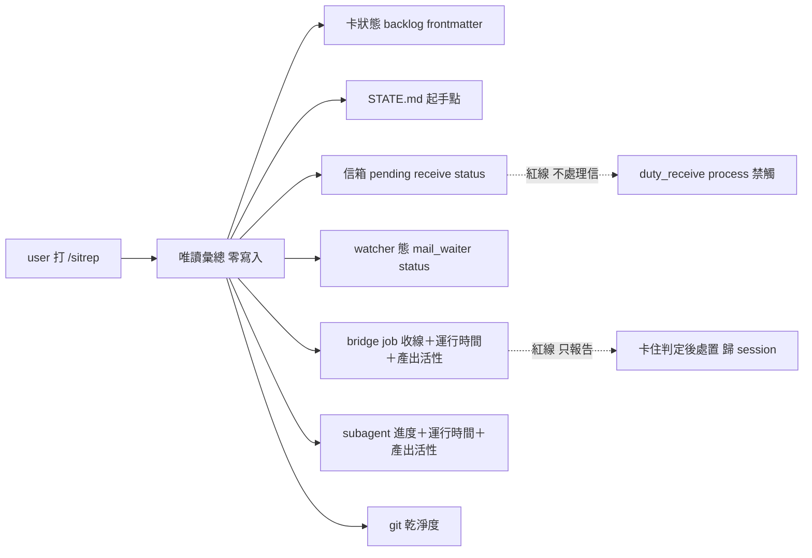

## Description

<!-- SECTION:DESCRIPTION:BEGIN -->
值星 session 打 `/sitrep` 一次看全況：現在做到哪、信箱有沒有信、watcher 活著嗎、bridge job／spawn 出去的 subagent 有沒有在動、做完有沒有回來說。純唯讀——只看不動。

**做什麼**：七面各一行、異常才展開——①active 卡狀態 ②STATE.md 起手點 ③信箱 pending ④watcher 態 ⑤bridge job 收線態 ⑥spawn subagent 進度 ⑦git 乾淨度。⑤⑥ 兩面都要帶**運行時間＋產出活性**（最後活動距今、產出是否还在增長）——因為 sub／bridge 工作有時會真的卡住，或做完了卻沒回報（terminal 未收／靜默完成都要現形）。
**不做什麼**：不處理信（duty_receive process 是 holder-gated 另一條鏈）、不 re-arm watcher、不收線 job、不 kill 卡住的 sub（只報告，處置歸 session 判斷）、不 commit。
**分工**：standup＝昨日回顧、sitrep＝現在快照；state-review＝深審；本 skill 是多面彙總的消費端，呼叫各機制既有唯讀面（mail_waiter status、agent_liveness_sweep、dutymail receive status、subagent 轉錄活性掃描），不重刻。

<!-- SECTION:DESCRIPTION:END -->
