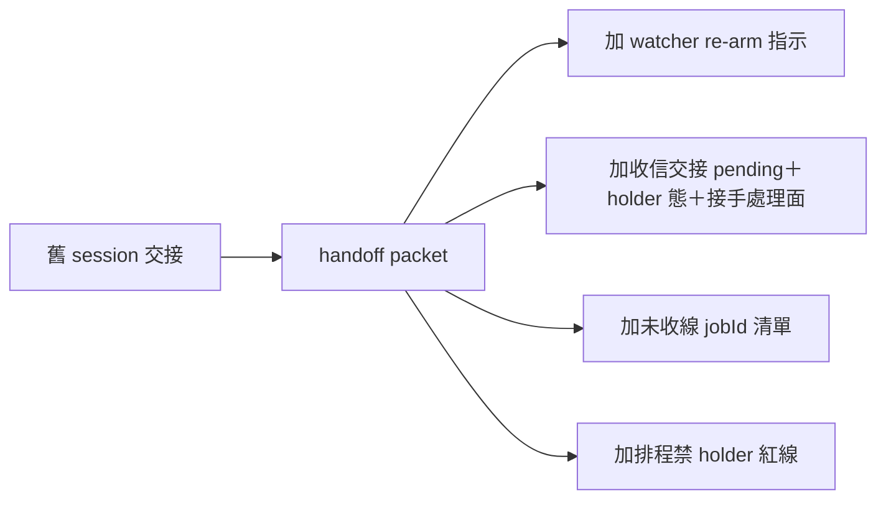

## Description

<!-- SECTION:DESCRIPTION:BEGIN -->
這幾天新落地的機制改變了「交接」該帶什麼，但 handoff skill 沒跟上。交接不只 bridge watcher：**收信責任本身也要交接**——信箱裡還沒處理的信、值星章在誰手上、下一班怎麼接手處理面，這些不寫進交接單就會漏。本卡把 watcher 重掛、收信交接、bridge job 收線一起補進 handoff skill。

**做什麼**：①Phase 0 加「盤點在飛 watcher＋收信現況」步——交接單帶 watcher re-arm 命令與驗證行＋信箱 pending 現況 ②收信面交接：holder 態（誰持章、lease 到期自然換手禁搶）＋未處理信清單怎麼帶 ③離場前 bridge job 未收線→交接單帶 jobId＋收線指引 ④冷啟歷史彙總喚醒＝正常非異常一句 ⑤執行約束加一行：交接對象為排程/autonomous session 時禁 holder/處置面指示（cron 吃信事故紅線的交接面落地）
**不做什麼**：不動 Phase 5 scbus 直送機制（仍現行）；不改 deep-work／autonomous-execution（紅線主落點若要擴到那邊另開卡）；不動引用本 skill 的 11 個檔案（已驗證段落級新增不破壞）

<!-- SECTION:DESCRIPTION:END -->
