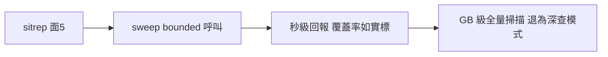
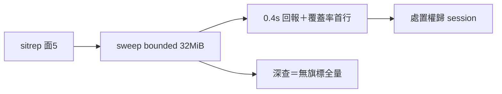

## Description

<!-- SECTION:DESCRIPTION:BEGIN -->
sitrep 面5 的 bridge job 盤點用 `agent_liveness_sweep.py`，但它對雙根 `jobs/*.jsonl` 全量逐檔 read_text（GB 級、只增不減），實測 22–30s+ 才一次性輸出——違「快速快照」體感。AIR-269 judge 裁定 skill 端以「耗時須知＋≥300s 逾時指引＋急巡跳過」收斂（已落地），根治解＝sweep 腳本本身加 bounded/增量掃描面（檔數/bytes 上限或 mtime 增量視窗），屬 bridge 收線觀測基建。

**做什麼**：sweep 加上限參數（如 --max-files／--max-bytes 或 --since）＋輸出加「掃描覆蓋率」聲明（bounded 時如實標未掃部分）；sitrep skill 面5 同步補 bounded 呼叫式。
**不做什麼**：不動分類語義（terminal-unclaimed/zombie 判準）；不重刻 bridge-dispatch 收線契約。

<!-- SECTION:DESCRIPTION:END -->

## Acceptance Criteria
<!-- AC:BEGIN -->
- [x] #1 AC1 sweep 有 bounded 參數且預設行為不變
- [x] #2 AC2 bounded 模式輸出覆蓋率聲明（未掃部分如實標）
- [x] #3 AC3 sitrep 面5 呼叫式更新為 bounded＋文件同步
- [x] #4 AC4 新參數測試＋既有套件全綠
- [x] #5 AC5 muse+codex consultation deltas 落實或逐條回饋
- [x] #6 AC6 bi+judge+post-build 全鏈收斂
<!-- AC:END -->

## Implementation Plan

<!-- SECTION:PLAN:BEGIN -->
〔baseline：ai-guide 95982514〕
〔已決策勿重辯：①bounded 參數方向（--max-files/--max-bytes/--since 擇一或組合＋覆蓋率聲明——consultation 後定案）②分類語義不動（terminal-unclaimed/zombie 判準）③不重刻 bridge-dispatch 收線契約④前置 consultation（user 指定 muse+codex 帶數據討論後實作）⑤AIR-269 judge 裁定的 skill 端耗時須知已落地，本卡做腳本根治＋sitrep 呼叫式同步〕
〔範圍：動 scripts/agent_liveness_sweep.py＋tests/＋skills/sitrep/SKILL.md 面5 呼叫式；不動其他一切〕
<!-- SECTION:PLAN:END -->

## Final Summary

<!-- SECTION:FINAL_SUMMARY:BEGIN -->
sweep bounded 掃描落地：--max-files/--max-bytes hard cap（任一出現即 bounded、無旗標全量零變）＋語義分層選檔序（running oldest-first 防 zombie 漏報／index 兜底）＋coverage 聲明（read-fail 可觀察／running=r/R／unscanned stat-only）＋sitrep 面5 bounded 呼叫式（32MiB 實測 0.35-0.48s，原全量 22-30s+）。全鏈：consultation（muse+codex 五題）→實作→bi（muse approve-with-findings/codex reject 兩 Important：read-fail 偽 coverage＋runtime 未達）→修正五項（F1-F5）→followup 重驗 pytest 14/14＋實跑兩次 0.38-0.48s→commit e2af22dc。

<!-- SECTION:FINAL_SUMMARY:END -->
