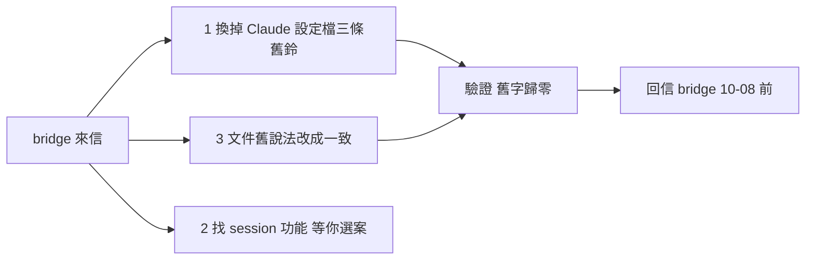
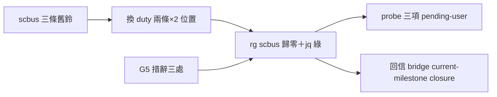

## Description

<!-- SECTION:DESCRIPTION:BEGIN -->
bridge 那邊正在把舊信箱系統（scbus）換成新信箱系統（dutymail）。換完之前他們寄信問我們：ai-guide 這邊有三個地方還掛著舊系統，請改掉並給期限。我們已回信承諾 **10-08 晚上前完成＋驗證＋回信**。偵察已完成，變更計畫逐檔逐條存放在 `.agent-tmp/air272-recon-plan.md`。

**三件事**：
1. **Claude 設定檔裡的三條舊鈴**——`~/.claude/settings.json`（其實就是 repo 裡那個 settings.json）有三條 hooks 還在喊舊信箱的命令：「收工鈴」那條直接刪（新系統沒這個鈴），另外兩條照現成模板換成新信箱的兩條。改前備份，改完檢查 scbus 這個字歸零。
2. **文件裡的舊說法**——兩三份文件還在教舊信箱的查詢指令，還有「信箱清空」的說法跟新規矩（備份要留、責任要清，不是把檔案刪光）打架——改成一致。
3. **找 session 的小功能**（等你選案）——「現在誰在上班」的查詢還依賴舊系統，但新信箱設計上故意不做登記簿。建議：暫時留著舊查詢（查不到會明確報錯，不會裝沒事），等 bridge 換代窗口開了再真換——**選哪案等你拍板**。

**不做**：舊信箱本體不動（bridge 還沒換完，動了會斷線）；寄信功能面不動（另一波）；歷史文件保留。

<!-- SECTION:DESCRIPTION:END -->

## Acceptance Criteria
<!-- AC:BEGIN -->
- [x] #1 AC1 settings.json 三條 scbus hooks 換 duty 兩條（SessionEnd 條目移除），rg scbus 歸零
- [x] #2 AC2 改前備份於 .agent-tmp、回滾路徑成文
- [x] #3 AC3 G5 措辭三處落地（ownership 兩處＋roundtrip 一行）
- [x] #4 AC4 面2 折衷案：fail-closed 驗證實跑＋fresh-session probe 草擬成文＋memory 三檔 disposition
- [x] #5 AC5 muse+codex consultation deltas 落實或逐條回饋
- [x] #6 AC6 bi+judge+post-build 全鏈收斂＋回信 bridge 交付
<!-- AC:END -->

## Implementation Plan

<!-- SECTION:PLAN:BEGIN -->
〔baseline：ai-guide 95982514〕
〔已決策勿重辯：①面 2 選案 (c)（user 核——折衷：保持 scbus 源＋fail-closed 已就緒、真換源綁 M7 另開卡）②INTENT-02 不動 scbus home ③send 面另一波次 ④技術計畫單一源＝.agent-tmp/air272-recon-plan.md（面1 三條 hooks 換 duty 兩條＋備份回滾；面3 兩檔措辭＋roundtrip 一行；面2 驗證 fail-closed＋probe 草擬＋memory 檔 disposition）⑤settings.json 為 primary repo root gitignored live 檔——WT 隔離例外，派工明示 ⑥前置 consultation（user 指定）〕
〔範圍：面1 settings.json＋hooks/AGENTS.md 一句；面3 governance/scbus-address-ownership.md＋skills/_common/dutymail-roundtrip.md；面2 驗證＋probe 草擬＋memory 檔 disposition；不動其他〕
<!-- SECTION:PLAN:END -->

## Implementation Notes

<!-- SECTION:NOTES:BEGIN -->
【AC4 補齊——probe 步驟可執行版（durability 修復：muse F1＋codex important）】

Pending-user-probe 三項（需真實 CC session；由 user 或下個含 CC 的班執行）：
P1 Running-session UPS hot-reload：既有 CC session 送新 prompt → PASS 判準＝duty-monitor baseline 檔（${XDG_STATE_HOME:-~/.local/state}/ai-guide/duty-monitor/<sid>.json）mtime 前進＋transcript 無 scbus hook 觸發跡。
P2 Fresh CC session SessionStart：開新 CC session → PASS＝duty hooks fire（SessionStart baseline 檔誕生）＋dutymail receive status --address ai-guide-marshal 可查（經 resolver zcode-cache rung）。
P3 Negative evidence：跨 session 邊界 stat -f %m ~/.sc-router/registry.db mtime 穩定（舊 scbus hook 未再觸碰）。

【handoff Phase 5 M7 缺口（codex important——durable 成文）】skills/handoff/SKILL.md Phase 5（現 :105-107）先直跑 session_discovery list/whoami（M7 拔源後 exit 3 source_unavailable/whoami_unavailable）才輪到 :115/:134 的 fallback-manual 分流——流程到不了降級路徑。後續卡＝consumer contract 補齊：source_unavailable/whoami_unavailable → fallback-manual（reason=discovery-unavailable、禁 direct send）＋consumer-level regression。已開 AIR-273 承接。

【resolver coupling 記錄】_resolve_binary() 階梯只查 zcode cache（不查 claude cache）——CC standalone 需擴第四 rung 或 env 導 DUTYMAIL_BIN（後續卡併 AIR-273 或獨立）。本機現況可解析（zcode cache 3.2.1/3.4.0/3.4.1 三候選）。

【AC4 判定更新】probe 步驟（本 note）＋handoff 缺口 durable 成文（本 note＋AIR-273）＋fail-closed 實跑（author 證據）＋memory disposition（codex PASS）→ AC4 完成。

【user 裁決 2026-10-07】pending-user-probe 三項免跑——「cc 就當會跑，我以後有問題再開卡修」。三項步驟保留在上方 notes（未來 CC 異常時的排查清單）。本卡就此收口。
<!-- SECTION:NOTES:END -->

## Final Summary

<!-- SECTION:FINAL_SUMMARY:BEGIN -->
db807 換源三面落地：面1 settings.json 三條 scbus hooks 換 duty 兩條（SessionEnd 刪；rg scbus 歸零；備份在場）；面3 G5 措辭三處＋消歧括註；面2 折衷案 c（零 code——fail-closed exit-3 實跑＋handoff 缺口成文開 AIR-273＋memory 三檔 disposition 池 commit 5f74cfc）。全鏈：consultation（muse+codex 五題）→實作→bi（muse approve-with-findings/codex reject AC4 durability）→probe 步驟成文＋AIR-273 補齊→雙腿解除條件滿足。pending-user-probe 三項（需真實 CC session）已成文於卡 notes——顯性未決，非結案阻斷。commit 975cecf6。

<!-- SECTION:FINAL_SUMMARY:END -->
