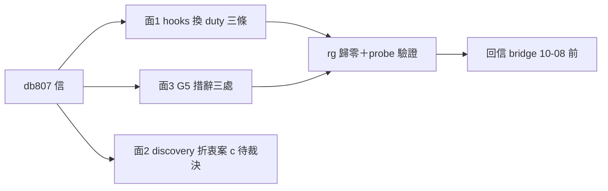

## Description

<!-- SECTION:DESCRIPTION:BEGIN -->
bridge db807 協調信換源三面落地（ack 已寄，承諾 10-08 EOD 前完成＋驗證＋回信）。偵察已完成（變更計畫逐檔逐條到手）。

**面 1 Claude-hooks（S）**：~/.claude/settings.json 是 symlink → repo 的 settings.json（live 同檔、gitignored）。三條 scbus hooks 在線（SessionEnd/SessionStart/UPS）→ 照 governance/registrations/cc.json 模板替換：SessionEnd scbus 移除（dutymail 無 SessionEnd 收信面）、SessionStart/UPS 換 duty_receive＋duty_mailbox_monitor 兩條。改前備份、改後 rg scbus 歸零驗證。
**面 3 G5 措辭（S）**：governance/scbus-address-ownership.md 兩處 scbus 指令教學改 dutymail receive status 現行面；dutymail-roundtrip.md 加一行 G5 語義（archive bytes 保留＋零 unowned obligations，非檔案歸零）；「baseline 歸零」加括註防混淆。
**面 2 discovery（需裁決）**：session_discovery.py 的 scbus list/whoami 是全 repo 唯一消費點，但 dutymail 設計上無 session registry——三案：(a) harness-native 掃描（M/L）(b) bridge ledger 涵蓋不足 (c) 折衷：保持 scbus 源＋typed fail-closed 已就緒、實作綁 M7 reader window（S）。**建議 (c)，真換源另開卡綁 M7。**
**不做什麼**：M7 前不動 scbus home（INTENT-02）；handoff_delivery 的 scbus send 面屬另一波次不動；凍結資產（frozen 標註檔、歷史 EP）保留。

<!-- SECTION:DESCRIPTION:END -->
