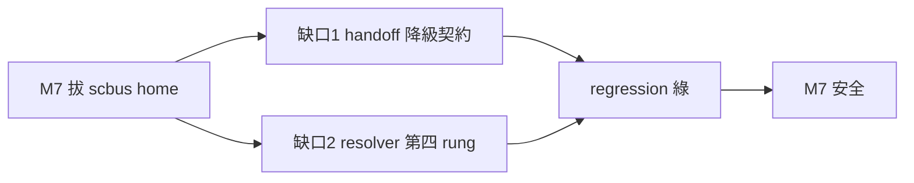
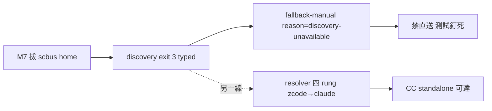

## Description

<!-- SECTION:DESCRIPTION:BEGIN -->
bridge 換代 sc-router 的 M7（拔 scbus home）之前，ai-guide 側有兩個已證實的缺口要補（AIR-272 驗收 codex important＋muse F1）：

**缺口 1（功能）**：skills/handoff/SKILL.md Phase 5（:105-107）直跑 session_discovery list/whoami——scbus 源拔掉後 exit 3（source_unavailable/whoami_unavailable）發生在 :115/:134 的 fallback-manual 分流**之前**，流程到不了降級路徑。補法＝consumer contract：兩 typed error → fallback-manual（reason=discovery-unavailable、禁 direct send）＋consumer-level regression 測試。
**缺口 2（穩健性）**：scripts/duty_receive.py `_resolve_binary()`（:58,:143-147）解析階梯只查 zcode plugin cache——CC 端 duty hooks 的存活依賴 zcode cache 不被清。補法＝加 claude cache 第四 rung 或 CC hook env 導 DUTYMAIL_BIN＋resolver test。

**做什麼**：兩缺口修復＋regression；引用面（handoff skill 文檔）同步。
**不做什麼**：不做 M7 拔源本身（bridge 權）；不動 session_discovery typed face（已就緒）。

<!-- SECTION:DESCRIPTION:END -->

## Acceptance Criteria
<!-- AC:BEGIN -->
- [x] #1 缺口 1 handoff Phase 5 consumer 降級契約三處落地（contract bullet／fallback 觸發清單／禁止清單）＋M7 前提措辭修正
- [x] #2 缺口 2 resolver claude-cache 第四 rung（zcode 優先序零變有對抗測試釘死；全 miss fail-loud）
- [x] #3 consumer-level regression：resolve_target discovery_unavailable 短路 5 案＋duty_receive 2 案（pytest 149＋3465 全綠）
- [x] #4 bi 複核雙腿收斂（muse approve／codex reject 兩項→修正迴圈→followup 全 verified）
<!-- AC:END -->

## Final Summary

<!-- SECTION:FINAL_SUMMARY:BEGIN -->
M7 前置兩缺口補齊：①handoff Phase 5 consumer 降級契約——session_discovery exit 3（source_unavailable/whoami_unavailable）→ fallback-manual（reason=discovery-unavailable）短路、禁直送；resolve-target 加 --discovery-unavailable flag＋exit-2 契約；skill 三處（contract/fallback 觸發清單/禁止清單）＋M7 前提措辭修正 ②resolver claude-cache 第四 rung（zcode 優先序零變、全 miss fail-loud）。全鏈：consultation 併 AIR-272 弧→實作→bi（muse approve/codex reject 兩項）→修正迴圈（consumer regression 5 案＋措辭）→followup pytest 149＋3465 全綠。commit 06baba1a；WT 收線零殘留。觀察項：mail_waiter/bridge_sweeper 同形 resolver 未同步——後續卡候選。

<!-- SECTION:FINAL_SUMMARY:END -->
