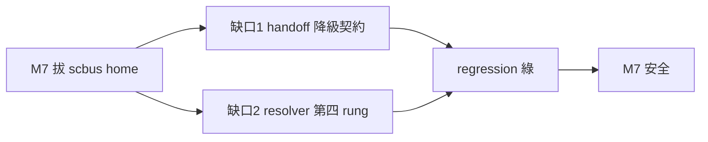

## Description

<!-- SECTION:DESCRIPTION:BEGIN -->
bridge 換代 sc-router 的 M7（拔 scbus home）之前，ai-guide 側有兩個已證實的缺口要補（AIR-272 驗收 codex important＋muse F1）：

**缺口 1（功能）**：skills/handoff/SKILL.md Phase 5（:105-107）直跑 session_discovery list/whoami——scbus 源拔掉後 exit 3（source_unavailable/whoami_unavailable）發生在 :115/:134 的 fallback-manual 分流**之前**，流程到不了降級路徑。補法＝consumer contract：兩 typed error → fallback-manual（reason=discovery-unavailable、禁 direct send）＋consumer-level regression 測試。
**缺口 2（穩健性）**：scripts/duty_receive.py `_resolve_binary()`（:58,:143-147）解析階梯只查 zcode plugin cache——CC 端 duty hooks 的存活依賴 zcode cache 不被清。補法＝加 claude cache 第四 rung 或 CC hook env 導 DUTYMAIL_BIN＋resolver test。

**做什麼**：兩缺口修復＋regression；引用面（handoff skill 文檔）同步。
**不做什麼**：不做 M7 拔源本身（bridge 權）；不動 session_discovery typed face（已就緒）。

<!-- SECTION:DESCRIPTION:END -->
