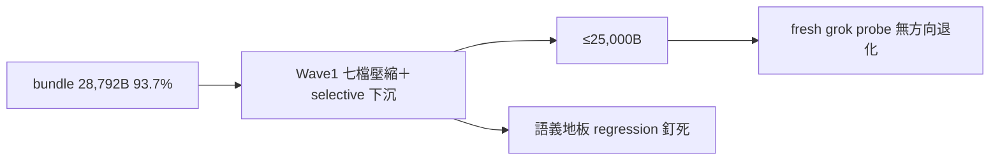

## Description

<!-- SECTION:DESCRIPTION:BEGIN -->
grok 端 rule bundle 28,792B（93.7%，超 WARN 線 2,680B）——四端 deployed 完全同構，瘦身同時救 muse 30KiB 安全面。muse＋codex 兩方案合成（分歧：下沉 vs 壓縮優先——取 codex 壓縮優先＋muse 不可動清單為地板；目標取 codex 嚴值 ≤25,000B）。

**做什麼（Wave 1）**：七檔 full rules 壓縮＋selective 下沉——collaboration（−350~500）／context-management（−500~700，steering/freshness/checkpoint floor 留）／design-thinking（−450~600，deep-thinking/arch-thinking sink）／edit-discipline（−200~300）／must-execute（−150~250，實跑義務留）／quality-constraints（−450~650，data-integrity/fail-loud floor 留）／acceptance-evidence（deep-body 下沉 −300~450，S/H/I/N floor 逐字留）。目標 −3.0~3.7KB → ≤25,000B；不足時 Wave 2（guide micro＋symbol-query wording）。
**不做什麼**：outward／tool-discipline／bridge-dispatch／model-routing／已 pointer 化四檔凍結（AIR-252 教訓：pointer 化丟 semantic floor）；rules/AGENTS.md／bash-hard-rules／code-edit-constraints 不碰（0B bundle 省益）；scope 分叉否決。

<!-- SECTION:DESCRIPTION:END -->
