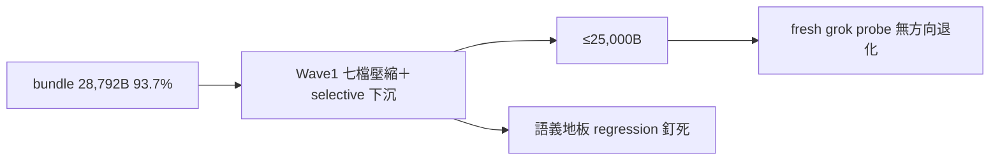

## Description

<!-- SECTION:DESCRIPTION:BEGIN -->
grok 端 rule bundle 28,792B（93.7%，超 WARN 線 2,680B）——四端 deployed 完全同構，瘦身同時救 muse 30KiB 安全面。muse＋codex 兩方案合成（分歧：下沉 vs 壓縮優先——取 codex 壓縮優先＋muse 不可動清單為地板；目標取 codex 嚴值 ≤25,000B）。

**做什麼（Wave 1）**：七檔 full rules 壓縮＋selective 下沉——collaboration（−350~500）／context-management（−500~700，steering/freshness/checkpoint floor 留）／design-thinking（−450~600，deep-thinking/arch-thinking sink）／edit-discipline（−200~300）／must-execute（−150~250，實跑義務留）／quality-constraints（−450~650，data-integrity/fail-loud floor 留）／acceptance-evidence（deep-body 下沉 −300~450，S/H/I/N floor 逐字留）。目標 −3.0~3.7KB → ≤25,000B；不足時 Wave 2（guide micro＋symbol-query wording）。
**不做什麼**：outward／tool-discipline／bridge-dispatch／model-routing／已 pointer 化四檔凍結（AIR-252 教訓：pointer 化丟 semantic floor）；rules/AGENTS.md／bash-hard-rules／code-edit-constraints 不碰（0B bundle 省益）；scope 分叉否決。

<!-- SECTION:DESCRIPTION:END -->

## Acceptance Criteria
<!-- AC:BEGIN -->
- [x] #1 AC1 Wave 1 七檔壓縮落地（−1,012B 機械對帳；四端 size gate 綠）
- [x] #2 AC2 語義地板錨點全數在場（三腿重構 21/21/25 全 PASS；AIR-252 E1 模式排除——sink 四處實承載）
- [x] #3 AC3 tri 審查全 approve-with-findings、無方向衝突；judge 裁決 findings 處置
- [x] #4 AC4 主 AC ≤25,000B 未達（結構性）——user 裁決「先90%」收 Wave 1 milestone，Wave 2 凍結面解凍另議
<!-- AC:END -->

## Implementation Notes

<!-- SECTION:NOTES:BEGIN -->
【Wave 1 milestone 收口——commit 09a3563e】bundle 28,792→27,780B（−1,012B，93.7%→90.4%）＋judge 五修（AGPL 可研究句/回 MIN 句/message_id 條件/回信段歸位/arch-thinking 指針，+70B→27,852B deployed）。全鏈：consultation（muse job-muy62n5v ✓／codex job-muy62n82 sandbox-error——3.5.0 升級剪除）→實作→tri 審查（muse muy7gzjb＋codex muy7gzkr＋GLM job-muy7h01r 全 approve-with-findings、無方向衝突）→marshal 依共識直接套用五處 Low 措辭修（免 judge——tri 收斂無分歧）。【主 AC ≤25,000B 未達＝結構性】floor 逐字釘死＋兩候選反向定義源＋凍結面——Wave 2（outward 等凍結面解凍）等 user 另議。【程序記錄】作者自報 /tmp diff 側檔即比即刪（三面掃描無殘留）；計數修正：pointer 化 6 檔（卡文 4）／未動 12 檔（申報 11）。【receipt】.agent-tmp/post-build-receipts/air-275.json

【Wave 2 開工——user 解凍裁決】AUTH=user 原話「5.3 codex 各自寫一個版本，然後codex 裁決看看怎樣截長補短，不用砍太兇，合理才砍」（前句確認解凍對象＝outward）。形態：GLM-5.3＋codex 各產一版壓縮稿（唯讀、final text 承載）→codex 裁決合併（截長補短；codex 自審自家版＝user 明示的形態，記錄在案）。範圍＝outward bundle-facing 節（①核心原則②Reversibility test③AUTH 模板④quote scope⑤授權來源⑥doc≠auth⑦Autonomous shortcut⑧Source of truth，進 bundle ~2.5KB）；Commit 專屬段（~3KB skip 段）禁碰。地板錨點（必須存活）：PENDING 回報格式／沉默≠同意／AUTH line 逐字／user-typed≠pasted 分界／undo 前可觀察判準／red-line 枚舉／Source of truth 聲明。目標：不用砍太兇——合理才砍，25KB 整數不強求。

【Wave 2 收口——合併定稿落地】形態＝GLM job-muyxx5zl（首跑串流未完成作廢）＋job-muz02bmt（重派完成）＋codex job-muyxx611 雙稿→codex job-muzde3ir 裁決合併（截長補短；對自家被退回段落明說；quote scope 兩稿各丟不同案例→退原文）。定稿 5,379B（bundle-facing −223B/9.1%；地板十錨點 10/10；skip 段逐字不動）。部署投影 27,852→27,629B（dry-run 實測吻合；gate 89% 綠、WARN 26,112B 仍超）。【誠實結論】≤25,000 主 AC 在「合理才砍」約束下結構性未達——Wave 1（未凍結不足 1.2KB）＋Wave 2（解凍後合理壓縮僅 223B）兩波實證壓縮空間耗盡；剩餘選項＝(a) 授權激進壓縮（安全條款風險）或 (b) 27,629B 收卡歸檔——待 user 裁決，卡維持 In Progress。
<!-- SECTION:NOTES:END -->

## Final Summary

<!-- SECTION:FINAL_SUMMARY:BEGIN -->
grok bundle 瘦身 Wave 1 milestone 收口（user 裁決「先90%」＋本日「可以先關掉」——主 AC ≤25,000B 歸 Wave 2 延後另議）：bundle 28,792→27,780B（−1,012B，93.7%→90.4%）＋judge 五修（AGPL 可研究句/回 MIN 句/message_id 條件/回信段歸位/arch-thinking 指針）＝27,852B deployed。全鏈：consultation（muse job-muy62n5v ✓／codex job-muy62n82 sandbox-error 未產 verdict）→實作→tri 審查（muse muy7gzjb＋codex muy7gzkr＋GLM job-muy7h01r 全 approve-with-findings、無方向衝突）→marshal 依共識套用五處 Low 措辭修（免 judge——tri 收斂）。【Wave 2 登記】凍結面解凍（outward 5,602B 等）需 user 明示範圍另議——muse 端離實測截斷線 32,000B 尚有 ~4.1KB，不急。

<!-- SECTION:FINAL_SUMMARY:END -->
