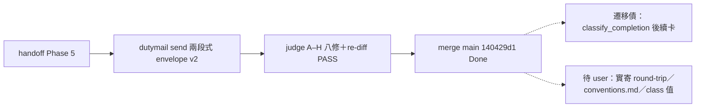

## Description

<!-- SECTION:DESCRIPTION:BEGIN -->
bridge db807 B0 協調信指名：skills/handoff/SKILL.md:128 仍是 scbus send --to（delivery leg 1）、:95 transport receipt 面、:168/:177 條文同步——遷移到 dutymail send＋receipt 詞形（dutymail-roundtrip.md 契約＝我方自寫）。P2 freeze（bridge 拔舊信箱前置）等此項完成。

**做什麼**：①handoff SKILL.md :128 send 面改 dutymail send（envelope v2、strict grammar——本班今日已實寄 7 封驗證契約）②:95 transport receipt 面改 dutymail receipts 詞形 ③:168/:177 條文同步 ④寄測試信 roundtrip 驗證（handoff → bridge 收訖）。
**不做什麼**：manual paste fallback 不動；dutymail-roundtrip.md 契約本體不動（只消費）；M7 拔 home 不動。

<!-- SECTION:DESCRIPTION:END -->

## Acceptance Criteria
<!-- AC:BEGIN -->
- [x] #1 send 面改 dutymail envelope v2 兩段式（build-body＋wrap）——✅ SKILL.md:126-135
- [x] #2 receipt 詞形分離（acceptance vs append-only 觀察面）＋三鍵齊——✅ :95-98
- [x] #3 consent gate/manual paste fallback 零漂移——✅ muse 軸3 PASS
- [x] #4 helper --reply-address 必填＋新測2案 RED→GREEN——✅ 49 passed
- [x] #5 judge A–H 八修全落＋marshal re-diff PASS——✅ 錨點親驗
<!-- AC:END -->

## Implementation Notes

<!-- SECTION:NOTES:BEGIN -->
【A5 交付收口——commit 52fc5004】skills/handoff/SKILL.md＋scripts/handoff_delivery.py（--reply-address 必填旗標）＋tests/test_handoff_delivery.py（新測2案＋空值 parametrize，RED 9→GREEN 49 passed）＋.review/air-276.md ledger（check-ignore 證實非 gitignored，留 commit 內作 durable 審查證據）。judge A–H 八修全落（marshal re-diff 親驗錨點 :95/:96/:98/:130/:131/:135＋helper :341）；F 項 8192 off-by-one 經凍結 oracle dry-parse 親證（8193B 拒收字串逐字）。【judge H 項卡面文字】classify_completion() 仍為 scbus schema（command_id/message_id/stages）＝遷移債：四段機械分類暫不支援 dutymail envelope 格式，遷移歸後續卡；過渡期完成判定以人工核對 acceptance＋scoped replies 為準。【judge ⚠️ 待 user 三項】①實寄 round-trip 未跑（send→accept→replies 完整鏈）；②conventions.md 節一 scbus 詞形同步；③class machine-header 值治理（現用 handoff）。【審查鏈】bi＝muse approve-with-findings（.agent-tmp/air276-bi-muse.md）／codex REJECT 3I2S（air276-bi-codex.md）；judge＝job-muyo2xoi stall→resume job-muyo82a2 conditional approve（air276-judge-verdict-final.md，明示免重跑 bi）；receipt=.agent-tmp/post-build-receipts/air-276.json

【實寄 round-trip 證據補全——judge ⚠️① 部分閉】①A5 sendtest 獲 bridge semantic ACK（db807-a5-sendtest-ack-001，duty hook 2026-10-08 surface）；②A5 完成信以交付後的兩段式管道 dogfood 寄出：envelopeId f167927c-e684-4a56-9c9b-010c816fe332、acceptanceSeq 31、to=delegate-bridge-marshal（門牌推導＝repo basename-marshal，即 G-fix 教學的首次實用）。AUTH=user 原話「完成要寄信通知 bridge」。剩 ⚠️②conventions.md 詞形、③class 值治理仍待 user。
<!-- SECTION:NOTES:END -->

## Final Summary

<!-- SECTION:FINAL_SUMMARY:BEGIN -->
A5 交付：scbus send → dutymail send 兩段式（build-body＋envelope v2 wrap）遷移完成並 merge main（rebase 後 140429d1）。judge A–H 八修全落＋helper --reply-address 必填旗標＋新測2案（RED→GREEN 49 passed；全套 3479 passed）。8192 off-by-one 經凍結 oracle 親證。遷移債（classify_completion dutymail 化）與待 user 三項（實寄 round-trip／conventions.md scbus 詞形／class 值治理）記 notes。receipt=.agent-tmp/post-build-receipts/air-276.json

<!-- SECTION:FINAL_SUMMARY:END -->
