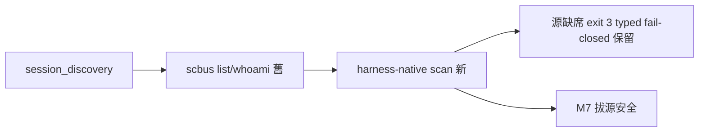

## Description

<!-- SECTION:DESCRIPTION:BEGIN -->
bridge db807 B0 協調信：A6＝scripts/session_discovery.py 的 scbus 消費換源——:85-105 `_collect_raw`（全 repo 唯一 scbus list 呼叫點）＋:39 `scbus whoami`，EP A6 紅線：兩者一起換（只換 list 會留活呼叫）。whoami 替代身份源已向 bridge 明名＝非 dutymail registry（M5 無 registry）。

**做什麼**：①_collect_raw 換 harness-native scan（zcode session store 直讀——zcode-session-query 查詢面形態）②whoami 換 harness workspace 對照 ③fail-closed 保留（源缺席 exit 3 typed——AIR-272 已驗）④跨 harness 覆蓋度評估（claude/codex session 的 discover 需求）⑤regression。
**不做什麼**：不做 dutymail registry（M5 否決）；不動 handoff_delivery（resolve-target 已有 fallback-manual 契約——AIR-273 已補）。

<!-- SECTION:DESCRIPTION:END -->
