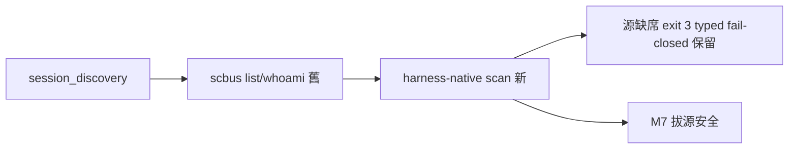
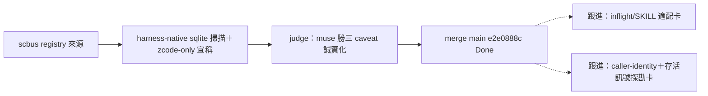

## Description

<!-- SECTION:DESCRIPTION:BEGIN -->
bridge db807 B0 協調信：A6＝scripts/session_discovery.py 的 scbus 消費換源——:85-105 `_collect_raw`（全 repo 唯一 scbus list 呼叫點）＋:39 `scbus whoami`，EP A6 紅線：兩者一起換（只換 list 會留活呼叫）。whoami 替代身份源已向 bridge 明名＝非 dutymail registry（M5 無 registry）。

**做什麼**：①_collect_raw 換 harness-native scan（zcode session store 直讀——zcode-session-query 查詢面形態）②whoami 換 harness workspace 對照 ③fail-closed 保留（源缺席 exit 3 typed——AIR-272 已驗）④跨 harness 覆蓋度評估（claude/codex session 的 discover 需求）⑤regression。
**不做什麼**：不做 dutymail registry（M5 否決）；不動 handoff_delivery（resolve-target 已有 fallback-manual 契約——AIR-273 已補）。

<!-- SECTION:DESCRIPTION:END -->

## Acceptance Criteria
<!-- AC:BEGIN -->
- [x] #1 list 換源 harness-native sqlite＋zcode-only typed 宣稱三處——✅
- [x] #2 whoami workspace 對照＋fail-closed exit 3 語義保留——✅ 兩腿一致確認
- [x] #3 消費端介面零破壞（八欄 row＋registry_total）——✅ codex 軸4
- [x] #4 judge 三 caveat 修全落＋70 passed／全套 3485 passed——✅ 錨點親驗
- [x] #5 ledger＋receipt 落盤——✅ .review/air-277.md＋.agent-tmp/post-build-receipts/air-277.json
<!-- AC:END -->

## Implementation Notes

<!-- SECTION:NOTES:BEGIN -->
【A6 交付收口——merge e2e0888c】3 檔 615+/344−；bi job-muyosb3l（muse approve 3 Minor）／job-muyosb4w（codex REJECT 3M1m）；judge job-muyozl5n approve-with-findings（muse 勝：store 無存活訊號/caller-identity API 係設計層缺失非實作錯；必修降為三處 docstring 宣稱誠實化——live=未封存非存活觀測、whoami=活躍度代理非身份保證、directory 精確匹配未正規化）。receipt=.agent-tmp/post-build-receipts/air-277.json。跟進兩卡已開（M7 拔源前完成）。【調查紀錄】本弧曾誤記 bi/judge 已跑（壓縮混記）——重派補跑， Chain 完整性以落盤 job 為準。
<!-- SECTION:NOTES:END -->

## Final Summary

<!-- SECTION:FINAL_SUMMARY:BEGIN -->

<!-- SECTION:FINAL_SUMMARY:END -->
