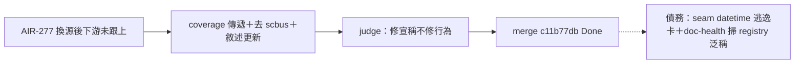

## Description

<!-- SECTION:DESCRIPTION:BEGIN -->
AIR-277 judge 跟進卡（codex F3＋muse F1/F3，不阻擋 A6）：inflight_snapshot.py 三處——①collect_scbus_sessions 回傳補 coverage 鍵傳遞（新 seam 已誠實宣稱但下游不轉發）②markdown 表頭「## scbus live sessions」＋footer「registry 總列」去 scbus 化＋live 語義對齊（live=未封存非存活觀測）③docstring「runner 注入形態保留」失實修正＋skills/handoff/SKILL.md :105/:116 機制敘述更新（:105 registry 唯一讀取點已非 registry、:116 OSError/CalledProcessError 同型 code 的 subprocess 路徑已刪）。時限：bridge M7 拔 scbus 源前完成。

<!-- SECTION:DESCRIPTION:END -->

## Acceptance Criteria
<!-- AC:BEGIN -->
- [x] #1 coverage 鍵自 seam 傳遞至 snapshot 輸出
- [x] #2 表頭/footer 去 scbus 化＋live 語義 caveat 對齊
- [x] #3 docstring runner 失實修正＋SKILL.md :105/:116 更新
<!-- AC:END -->

## Definition of Done
<!-- DOD:BEGIN -->
- [x] #1 驗證附機械證據（pytest＋rg 錨點）
- [x] #2 老規矩審查鏈（muse＋codex＋judge）
<!-- DOD:END -->

## Implementation Notes

<!-- SECTION:NOTES:BEGIN -->
【收口——f1838d55＋judge 修 d0e3b243】bi：codex job-muyyjjzb（需修正：F1 typed 全涵蓋宣稱過強——marshal 親驗 datetime 逃逸成立）＋GLM job-muzde3ef（PASS 六軸；首派 job-muyyjkg1 failed-usage 作廢）→judge job-muzezky5 需修正後通過（修法 (a) 收緊宣稱：已處理路徑 typed／未捕獲例外非零 exit 一律同 fallback；seam 零 diff 維持；datetime 修復歸 seam 卡）。receipt=.agent-tmp/post-build-receipts/air-281.json
<!-- SECTION:NOTES:END -->

## Final Summary

<!-- SECTION:FINAL_SUMMARY:BEGIN -->

<!-- SECTION:FINAL_SUMMARY:END -->
