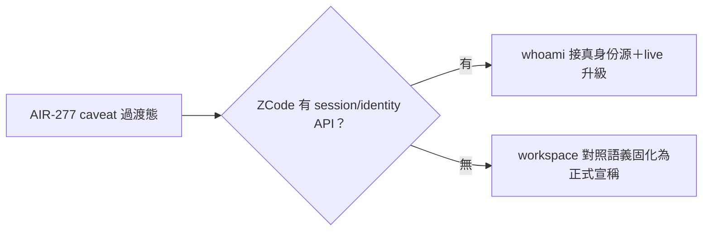
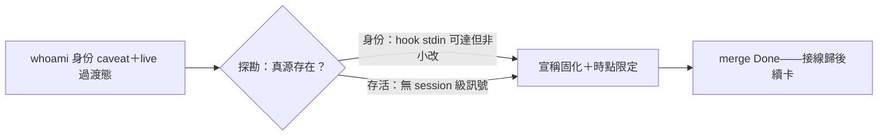

## Description

<!-- SECTION:DESCRIPTION:BEGIN -->
AIR-277 judge 跟進卡（codex F1/F2 根治面，不阻擋 A6）：探勘兩事——①ZCode runtime 是否有 session API/env 注入面可接真呼叫者身份（有→whoami 換真身份源；無→將 workspace 對照語義固化為正式宣稱——現 docstring caveat 為過渡）②zcode store 是否有真存活訊號可升級 live 語義（無則維持「未封存≠存活」宣稱）。紅線：禁 mtime 啟發式（猜測違禁猜精神）。可與跟進①併弧或另弧。

<!-- SECTION:DESCRIPTION:END -->

## Acceptance Criteria
<!-- AC:BEGIN -->
- [x] #1 探勘結論落卡（有源→接線；無源→宣稱固化）
<!-- AC:END -->

## Definition of Done
<!-- DOD:BEGIN -->
- [x] #1 探勘證據附 file:line
- [x] #2 老規矩審查鏈
<!-- DOD:END -->

## Implementation Notes

<!-- SECTION:NOTES:BEGIN -->
【收口——b4db2e2b＋合議兩修 e34bf34e】探勘定案：①身份＝hook stdin payload session_id 唯一權威（CLI 面本次探勘未發現注入面——接線非小改歸後續卡）②存活＝無 session 級訊號（live 維持未封存；過期重探條件入 docstring）。bi：codex CONDITIONAL PASS＋GLM PASS——實質收斂同修法（時點限定），marshal 合議免 judge。receipt=.agent-tmp/post-build-receipts/air-282.json
<!-- SECTION:NOTES:END -->

## Final Summary

<!-- SECTION:FINAL_SUMMARY:BEGIN -->

<!-- SECTION:FINAL_SUMMARY:END -->
