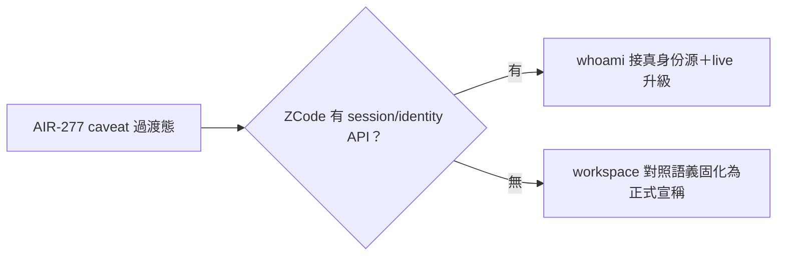
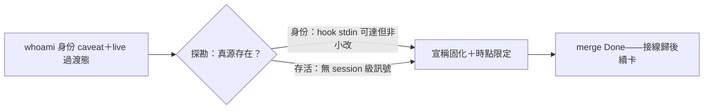

## Description

<!-- SECTION:DESCRIPTION:BEGIN -->
AIR-277 judge 跟進卡（codex F1/F2 根治面，不阻擋 A6）：探勘兩事——①ZCode runtime 是否有 session API/env 注入面可接真呼叫者身份（有→whoami 換真身份源；無→將 workspace 對照語義固化為正式宣稱——現 docstring caveat 為過渡）②zcode store 是否有真存活訊號可升級 live 語義（無則維持「未封存≠存活」宣稱）。紅線：禁 mtime 啟發式（猜測違禁猜精神）。可與跟進①併弧或另弧。

<!-- SECTION:DESCRIPTION:END -->

## Acceptance Criteria
<!-- AC:BEGIN -->
- [x] #1 探勘結論落卡（有源→接線；無源→宣稱固化）
<!-- AC:END -->

## Definition of Done
<!-- DOD:BEGIN -->
- [x] #1 探勘證據附 file:line
- [x] #2 老規矩審查鏈
<!-- DOD:END -->

## Implementation Notes

<!-- SECTION:NOTES:BEGIN -->
<<<<<<< HEAD
【收口——b4db2e2b＋合議兩修 e34bf34e】探勘定案：①身份＝hook stdin payload session_id 唯一權威（CLI 面本次探勘未發現注入面——接線非小改歸後續卡）②存活＝無 session 級訊號（live 維持未封存；過期重探條件入 docstring）。bi：codex CONDITIONAL PASS＋GLM PASS——實質收斂同修法（時點限定），marshal 合議免 judge。receipt=.agent-tmp/post-build-receipts/air-282.json

AIR-282 探勘結論（2026-10-08，card WT 實機）——

題1 呼叫者身份源：ZCode runtime 對 CLI 子程序無身份注入面；唯一權威身份源＝hook stdin payload 的 session_id，但僅 hook 程序內可達——whoami 是 CLI face 接不上，接線非小改（須新 hook＋指針機制）。證據：①env 實機僅 ZCODE_BUILTIN_PROVIDER_CONFIG_FILE/ZCODE_PERSONAL_PROVIDER_CONFIG_FILE/ZCODE_RUNTIME_ENV，無 session id；②ref-docs/harness/zcode/cn/docs/hooks.md:149-166 stdin 契約明載 session_id 欄（transcript_path 為臨時檔禁長期存儲）；③hooks/hook_payload_compat.py:98-101＋hooks/duty_receive.py:122 hook 前導實際消費；④機械實證值同形：~/.local/state/ai-guide/duty-receive/sess_45c4a908-….json（hook payload 命名）↔ db.sqlite session.id sess_45c4a908-b48f-4f4d-937b-49746f95d760 完全一致；⑤zcode CLI（zcode.cjs v0.16.9 --help）命令集無 session 查詢 face；⑥~/.zcode/cli/ 無 current-session 指針檔（find current/active/pointer 零命中；rollout/exec per-session 附屬檔的歸屬判定只能靠 mtime＝紅線）；⑦wt-identity.json（scripts/wt-open.sh:175）＝WT/card identity 非 session identity。處置＝docstring caveat 轉正式語義（session_discovery.py _whoami_raw），已實作。信心：高。

題2 存活訊號源：無 session 級真存活訊號——live 維持「未封存≠存活」宣稱。證據：①turn_usage.status 雖有 running 值（schema check constraint）但全史 0/12,896 筆 running＝事後帳非心跳（本 session 進行中亦無列）；②session_entry runtime/workspace_checkpoint（46,295 列）活躍期每數秒一列，但「最近列」＝recency 啟發式（與 mtime 同認識類，紅線禁提議）；③程序面：10 個 zcode-cli 程序 lsof -d cwd 全部 cwd=workspace root（實測慣例非文檔契約），僅 workspace 級代理——ai-guide 2 程序 vs store 3 條未封存列，process↔session row 無法 1:1；subagent 無獨立程序不可見；ps -E/launchctl procinfo 讀不到 zcode-cli env；④db.sqlite session 表無 alive/heartbeat 欄。信心：高。

實作：scripts/session_discovery.py 兩處 docstring 固化（模組 live 段＋_whoami_raw 身份段，探勘證據寫入）；驗證＝ruff clean＋test_session_discovery 58 passed＋全套 3491 passed 1 skipped；whoami 卡 WT 實跑 typed fail（whoami_unavailable exit 3，fail-closed 正確）。建議後續：若要真身份源，開卡設計 hook 指針機制（PreToolUse 寫 per-cwd session pointer＋staleness 語義）——超出本卡小改範圍。
<!-- SECTION:NOTES:END -->

## Final Summary

<!-- SECTION:FINAL_SUMMARY:BEGIN -->

<!-- SECTION:FINAL_SUMMARY:END -->
