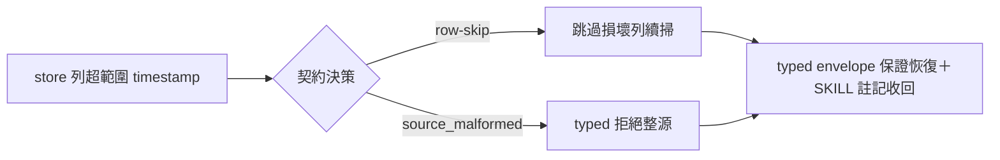

## Description

<!-- SECTION:DESCRIPTION:BEGIN -->
session_discovery.py 的 `_last_seen_iso`（:320 `datetime.fromtimestamp(us/1e6, tz=UTC)`）無範圍防護——store 列含超範圍 last_seen_us 時拋 ValueError/OverflowError，逃出 main() 的 except DiscoveryError，exit 3 typed envelope 保證破洞（codex job-muyyjjzb F1 親驗成立；judge job-muzezky5 裁決本卡不改 seam——修復屬新契約決策另開卡）。本卡要決：列值損壞時 row-skip（跳過該列續掃）還是整源 source_malformed（typed 拒絕）——紅線參照 quality-constraints crash-only（損壞比缺失危險）＋ AIR-281 judge『row-skip 還是整源 malformed 是新契約決策，須另立 RED 測試』。修後 SKILL.md:116『罕見未捕獲例外』註記可收回。

<!-- SECTION:DESCRIPTION:END -->

## Acceptance Criteria
<!-- AC:BEGIN -->
- [ ] #1 契約決策落卡（row-skip vs source_malformed）＋RED→GREEN 修復
- [ ] #2 SKILL.md:116 罕見例外註記收回
<!-- AC:END -->

## Definition of Done
<!-- DOD:BEGIN -->
- [ ] #1 老規矩審查鏈（codex＋5.3＋judge）
<!-- DOD:END -->

## Implementation Notes

<!-- SECTION:NOTES:BEGIN -->
【bridge 裁決融入——三方收斂】bridge 主動寄裁定（db807-air284-ruling-001＋addendum-001）：(b) 嚴格整源 source_malformed＋riders（診斷指名問題列；真實壞列常態化才設計 malformedRows deliberate feature）＋codex 補強（consumer contract source_malformed 降級驗證；except 限縮 ValueError/OverflowError/OSError）。我方雙腿諮詢（codex job-muzjh5uv＋GLM job-muzjh6b9）獨立同案——三方收斂，author 已依此實作。
<!-- SECTION:NOTES:END -->
