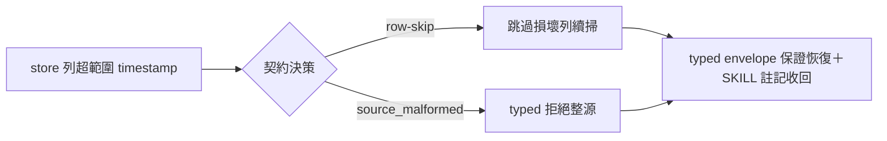
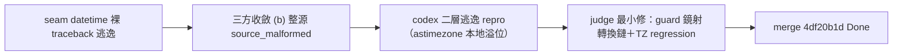

## Description

<!-- SECTION:DESCRIPTION:BEGIN -->
session_discovery.py 的 `_last_seen_iso`（:320 `datetime.fromtimestamp(us/1e6, tz=UTC)`）無範圍防護——store 列含超範圍 last_seen_us 時拋 ValueError/OverflowError，逃出 main() 的 except DiscoveryError，exit 3 typed envelope 保證破洞（codex job-muyyjjzb F1 親驗成立；judge job-muzezky5 裁決本卡不改 seam——修復屬新契約決策另開卡）。本卡要決：列值損壞時 row-skip（跳過該列續掃）還是整源 source_malformed（typed 拒絕）——紅線參照 quality-constraints crash-only（損壞比缺失危險）＋ AIR-281 judge『row-skip 還是整源 malformed 是新契約決策，須另立 RED 測試』。修後 SKILL.md:116『罕見未捕獲例外』註記可收回。

<!-- SECTION:DESCRIPTION:END -->

## Acceptance Criteria
<!-- AC:BEGIN -->
- [x] #1 契約決策落卡（row-skip vs source_malformed）＋RED→GREEN 修復
- [x] #2 SKILL.md:116 罕見例外註記收回
<!-- AC:END -->

## Definition of Done
<!-- DOD:BEGIN -->
- [x] #1 老規矩審查鏈（codex＋5.3＋judge）
<!-- DOD:END -->

## Implementation Notes

<!-- SECTION:NOTES:BEGIN -->
【bridge 裁決融入——三方收斂】bridge 主動寄裁定（db807-air284-ruling-001＋addendum-001）：(b) 嚴格整源 source_malformed＋riders（診斷指名問題列；真實壞列常態化才設計 malformedRows deliberate feature）＋codex 補強（consumer contract source_malformed 降級驗證；except 限縮 ValueError/OverflowError/OSError）。我方雙腿諮詢（codex job-muzjh5uv＋GLM job-muzjh6b9）獨立同案——三方收斂，author 已依此實作。

【收口——533a613f＋judge 二層修 3294da07】三方收斂 (b) 落地＋consumer rider（source_malformed→fallback 綁定測試）＋SKILL:116 註記收回。bi：codex job-muzkxrle REQUEST CHANGES（F1 二層逃逸——.astimezone() 本地轉換溢位 repro）／GLM job-muzkxs6b approve→judge job-muzl7i3x codex 成立（最小修 guard 鏡射轉換鏈＋TZ regression）→marshal 直套→69 passed。語義邊界備查：whoami 整源範圍＝workspace 過濾後查詢（他 workspace 壞列不觸發）——GLM suggestion 記錄。改判條件：真實壞列常態化→per-row malformedRows deliberate feature 另立卡。receipt=.agent-tmp/post-build-receipts/air-284.json

【author 實作 Notes（union 保留）】契約決策：(b) 嚴格——整源 source_malformed（三方收斂）。row-skip 禁——list 亦是 address resolution 上游，部分成功比明確失敗危險（codex 腿決定性理由）。實作錨點：驗證在共同來源處理路徑 _query_store 逐列呼叫 _require_representable_last_seen——list/find 查詢範圍任一列壞→整次 source_malformed；whoami 經既有 remap→whoami_malformed（採 codex 腿細分：whoami_* 代碼族語義既存、remap 基建零結構變更即接通）。例外族限縮 ValueError/OverflowError/OSError（機驗：±inf→OverflowError、NaN/year 超界→ValueError、平台 time_t 溢位→OSError）；NULL／非數值保留缺值語義；禁 plausibility window 二猜層。consumer rider（bridge 補強④）：resolve-target --discovery-unavailable 對四 typed code 皆降 fallback-manual 禁直送——枚舉補齊 handoff_delivery.py docstring/help＋SKILL.md:183 drift 同步。改判條件（⑤）：真實壞列常態化→per-row malformedRows deliberate feature 須另立契約卡重審；本卡裁決不預留該層。
<!-- SECTION:NOTES:END -->

## Final Summary

<!-- SECTION:FINAL_SUMMARY:BEGIN -->

<!-- SECTION:FINAL_SUMMARY:END -->
