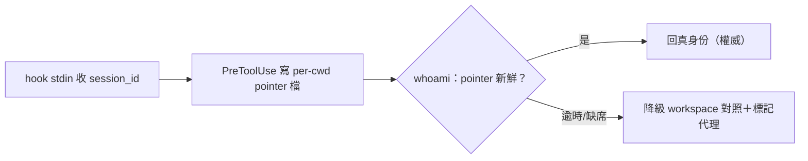

## Description

<!-- SECTION:DESCRIPTION:BEGIN -->
AIR-282 探勘定案：CLI 面無身份注入面（本次探勘），唯一權威身份源＝hook stdin payload 的 session_id 但僅 hook 程序內可達——whoami（CLI face）接不上，現為 workspace 對照活躍度代理。本卡設計接線：新 hook（PreToolUse 類，收 stdin session_id）寫 per-cwd session pointer 檔（如 ~/.local/state/ai-guide/identity/<realpath-cwd>.json）；session_discovery _whoami_raw 先讀 pointer（staleness 語義決定信任邊界——逾時降級 workspace 對照並標記），fallback 既有路徑不變；跨 harness 權限邊界與 pointer 污染面（他人可寫檔？）須設計。default 語義、flush 時機、多 session 同 cwd 並行的指針覆蓋策略皆本卡契約決策。

<!-- SECTION:DESCRIPTION:END -->

## Acceptance Criteria
<!-- AC:BEGIN -->
- [ ] #1 指針機制設計落卡（staleness／權限／並行覆蓋三契約）
- [ ] #2 whoami 先讀 pointer＋fallback 降級路徑 RED→GREEN
<!-- AC:END -->

## Definition of Done
<!-- DOD:BEGIN -->
- [ ] #1 老規矩審查鏈（codex＋5.3＋judge）
<!-- DOD:END -->
