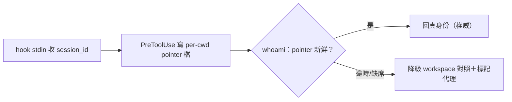
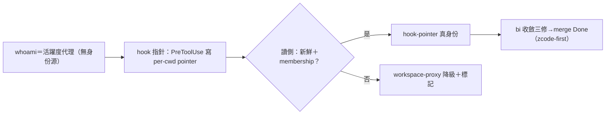

## Description

<!-- SECTION:DESCRIPTION:BEGIN -->
AIR-282 探勘定案：CLI 面無身份注入面（本次探勘），唯一權威身份源＝hook stdin payload 的 session_id 但僅 hook 程序內可達——whoami（CLI face）接不上，現為 workspace 對照活躍度代理。本卡設計接線：新 hook（PreToolUse 類，收 stdin session_id）寫 per-cwd session pointer 檔（如 ~/.local/state/ai-guide/identity/<realpath-cwd>.json）；session_discovery _whoami_raw 先讀 pointer（staleness 語義決定信任邊界——逾時降級 workspace 對照並標記），fallback 既有路徑不變；跨 harness 權限邊界與 pointer 污染面（他人可寫檔？）須設計。default 語義、flush 時機、多 session 同 cwd 並行的指針覆蓋策略皆本卡契約決策。

<!-- SECTION:DESCRIPTION:END -->

## Acceptance Criteria
<!-- AC:BEGIN -->
- [x] #1 指針機制設計落卡（staleness／權限／並行覆蓋三契約）
- [x] #2 whoami 先讀 pointer＋fallback 降級路徑 RED→GREEN
<!-- AC:END -->

## Definition of Done
<!-- DOD:BEGIN -->
- [x] #1 老規矩審查鏈（codex＋5.3＋judge）
<!-- DOD:END -->

## Implementation Notes

<!-- SECTION:NOTES:BEGIN -->
【收口——0531dcdd＋合議三修 a2946ca6】bi：codex job-muzl85nc（PASS-with-Suggestions：F1 測試斷言假通過／F2 植入偵測未真驗）＋GLM job-muzl863m（PASS：F1 tmp 殘留／F2 揭露未落持久面）——兩腿收斂 approve 合議免 judge，三修直套（glob 斷言／植入偵測真驗／tmp unlink）。【揭露落持久（GLM F2）】author 自報：測試/smoke 曾寫真實 home state（~/.local/state/ai-guide/identity/）——雜訊指針檔已清＋測試改 env 注入 hermetic；GLM 機驗 identity/ 已不存在。設計決策表 D1-D8＋跨 harness 素材（grok/codex/cc）詳 ledger=.review/air-286.md。未驗：live 觸發鏈（installer＋新 session 歸部署段）。receipt=.agent-tmp/post-build-receipts/air-286.json
<!-- SECTION:NOTES:END -->

## Final Summary

<!-- SECTION:FINAL_SUMMARY:BEGIN -->

<!-- SECTION:FINAL_SUMMARY:END -->
