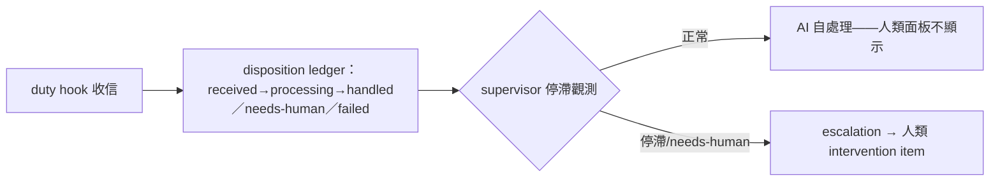

## Description

<!-- SECTION:DESCRIPTION:BEGIN -->
bridge db-99 兩腿收斂設計的 ai-guide 消費端份（card 級增量、dutymail 零改動）：①consumer-owned semantic disposition ledger——duty hook 鏈收信處理狀態帳（received→processing→handled／needs-human／failed；LLM 消費端自持，非 transport receipts 軸）②Consumer Supervisor——處理停滯觀測→consumer health alert→符合 escalation 條件才轉人類 intervention item。operator 原則：「AI 讀取處理了就不用顯示；人只處理需要人介入的」。GLM 實證：SC 已 80% 就位（SC-257 人讀≠已讀、isMachineClosed 自動關帳、inbox(N)=WORK PILING UP）；ai-guide 增量＝disposition ledger＋supervisor，非面板重做。

<!-- SECTION:DESCRIPTION:END -->

## Acceptance Criteria
<!-- AC:BEGIN -->
- [ ] #1 disposition ledger 落地（四態流轉＋機驗）
- [ ] #2 supervisor 停滯觀測＋escalation 條件
- [ ] #3 dutymail 零改動（消費端自持）
<!-- AC:END -->

## Definition of Done
<!-- DOD:BEGIN -->
- [ ] #1 老規矩審查鏈（codex＋5.3＋judge）
<!-- DOD:END -->
