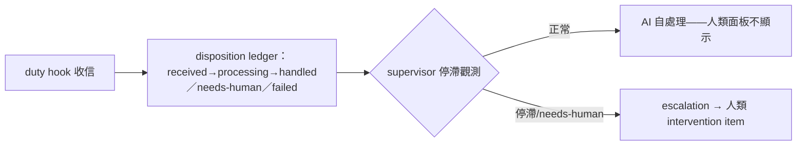
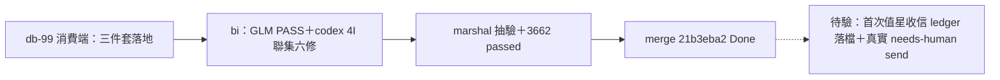

## Description

<!-- SECTION:DESCRIPTION:BEGIN -->
bridge db-99 兩腿收斂設計的 ai-guide 消費端份（card 級增量、dutymail 零改動）：①consumer-owned semantic disposition ledger——duty hook 鏈收信處理狀態帳（received→processing→handled／needs-human／failed；LLM 消費端自持，非 transport receipts 軸）②Consumer Supervisor——處理停滯觀測→consumer health alert→符合 escalation 條件才轉人類 intervention item。operator 原則：「AI 讀取處理了就不用顯示；人只處理需要人介入的」。GLM 實證：SC 已 80% 就位（SC-257 人讀≠已讀、isMachineClosed 自動關帳、inbox(N)=WORK PILING UP）；ai-guide 增量＝disposition ledger＋supervisor，非面板重做。

<!-- SECTION:DESCRIPTION:END -->

## Acceptance Criteria
<!-- AC:BEGIN -->
- [x] #1 disposition ledger 落地（四態流轉＋機驗）
- [x] #2 supervisor 停滯觀測＋escalation 條件
- [x] #3 dutymail 零改動（消費端自持）
<!-- AC:END -->

## Definition of Done
<!-- DOD:BEGIN -->
- [x] #1 老規矩審查鏈（codex＋5.3＋judge）
<!-- DOD:END -->

## Implementation Notes

<!-- SECTION:NOTES:BEGIN -->
【bridge 裁定信融入——db99-ruling-aig-001】架構定案：正常信留 LLM 地址全消費；needs-human→exception mail（自帶原文＋來源連結）進專用 exception 地址；consumer disposition ledger；supervisor 消費者側；人類待辦＝unresolved exceptions 計數；dutymail 零變更。scope 增量＝exception 地址的接收＋exception forwarding（duty_receive/marshal 處理慣例加 triage disposition）——FENCING_CODES 同族第二分類面。與 C0/P6 正交。SC 側已 80% 就位（SC-257／isMachineClosed／inbox(N)=WORK PILING UP）；📮 待認領節點 scbus snapshot 源經 SC-325 退役永不 materialize。投影語義裁定：inbox transport 計數＝consumer-backlog 警示非未讀數。

【收口——dc7048fb＋雙腿修 21b3eba2】bi：GLM job-muzncuxu PASS 附條件／codex job-muznpk1f（重派；首派 job-muzncug7 憑證失效）CHANGES REQUESTED 4 Important——六修聯集全落（auto 推進點裁定＝digest 呈現完成即 handled、ack≠done 語義；mkstemp 唯一化；ESC state typed；get/list 統一 gate；needs-human 入監視面；flock）。全套 3662 passed。揭露：RED 事故（真實 state 污染）已清已修。例外地址 ai-guide-exceptions=40a9f4b9。receipt=.agent-tmp/post-build-receipts/air-287.json
<!-- SECTION:NOTES:END -->

## Final Summary

<!-- SECTION:FINAL_SUMMARY:BEGIN -->

<!-- SECTION:FINAL_SUMMARY:END -->
