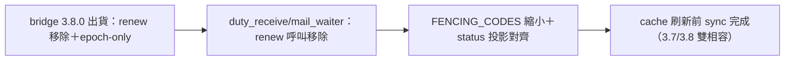
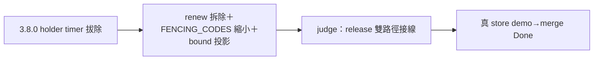

## Description

<!-- SECTION:DESCRIPTION:BEGIN -->
bridge 3.8.0 出貨（db-98 B 案：holder timer lease 拔除——authority＝address＋epoch＋token＋binding active 無時鐘；renew 面 typed removal；batch TTL 60s 保留；schema v4 additive）的 ai-guide 消費端 sync 義務：①scripts/duty_receive.py＋mail_waiter 相關的 holder renew 呼叫移除（3.8.0 回 typed usage error；拆掉後對 3.7/3.8 雙相容——不 renew 只會 lease 自然過期走既有 rebind 路由）②FENCING_CODES 縮小：lease-expired 退役（原生不再發生），留 stale-epoch／holder-token-mismatch③holder status 投影對齊：live→bound 欄位改名、leaseExpiresAtUs 不存在④v3 舊 store 需 store migrate 才能走 3.8.0 stable face——本機 store 查版本（4.x 已是 v4 則免）。時限：cache 刷新解析到 3.8.0 前（bridge 指名 sync 義務 urgent）。

<!-- SECTION:DESCRIPTION:END -->

## Acceptance Criteria
<!-- AC:BEGIN -->
- [x] #1 renew 呼叫移除（rg 歸零）＋雙版相容說明
- [x] #2 FENCING_CODES 縮小（lease-expired 退役）
- [x] #3 holder status 投影對齊（bound／無 leaseExpiresAtUs）
- [x] #4 store schema 版本確認或 migrate 指引
<!-- AC:END -->

## Definition of Done
<!-- DOD:BEGIN -->
- [ ] #1 老規矩審查鏈（codex＋5.3＋judge）
<!-- DOD:END -->

## Implementation Notes

<!-- SECTION:NOTES:BEGIN -->
【收口——6c59b7ca＋judge 修 68eccd53（5 commits）】三必修全落：MF2 holder_active fail-loud／MF1(ii) ZCode death-evidence takeover（24h 心跳閾值）／MF1(i) SessionEnd release 接線（codex/grok 註冊＋hooks/duty_holder_release.py）＋item 6(c) lifecycle 測試＋真 store demo（bind→prepare→release→rebind＋fencedBatches 實錄）。全套 3695 passed。receipt=.agent-tmp/post-build-receipts/air-288.json
<!-- SECTION:NOTES:END -->

## Final Summary

<!-- SECTION:FINAL_SUMMARY:BEGIN -->
3.8.0 consumer sync 四義務全落＋judge 三修（release 雙路徑＋death-evidence takeover＋item 6 三驗收）→merge 68eccd53。真 store demo 實錄（bind→prepare→release→rebind＋fencedBatches）。全套 3695 passed。

<!-- SECTION:FINAL_SUMMARY:END -->
