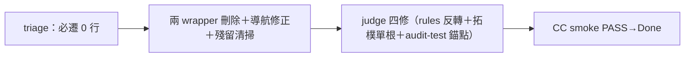

## Description

<!-- SECTION:DESCRIPTION:BEGIN -->
前置：AIR-289（生成者先改）。①root CLAUDE.md 內容逐段 triage：已由 instruction-writing/memory-audit 定義的原則刪除重複投影；仍有效的 Claude 專屬知識歸入適當 skill；已退役的 CC 註冊路徑（AIR-215 ~/.claude/agents、~/.claude/rules）刪除過時敘述；AGENTS.md 保持 harness-neutral 不收 Claude 專屬內容②skills/CLAUDE.md 純 wrapper 直接刪③AGENTS.md 導航修正（原 wrapper 承載的入口）。驗收：rg -l . --hidden --glob CLAUDE.md --glob !**/.git/** 為空；rg CLAUDE.md skills/ rules/ AGENTS.md 分類殘留（歷史記錄可留；有效雙檔要求／失效錨點／重生 wrapper 指令不得留）。

<!-- SECTION:DESCRIPTION:END -->

## Acceptance Criteria
<!-- AC:BEGIN -->
- [x] #1 rg CLAUDE.md 全 repo 為空（除 .git）
- [x] #2 root 有效內容遷移無遺失（triage 對照表）
- [x] #3 AGENTS 導航完整
<!-- AC:END -->

## Definition of Done
<!-- DOD:BEGIN -->
- [x] #1 CC consumer smoke（新 session root/nested 載入實證——獨立於 pytest）
<!-- DOD:END -->

## Implementation Notes

<!-- SECTION:NOTES:BEGIN -->
【前置 triage 完成（.agent-tmp/air290-triage.md）】root CLAUDE.md 25 行三桶：刪除（重複投影）4 處——memory-audit 載體統一定義表＋instruction-writing 覆蓋；刪除（過時 AIR-215）5 處——~/.claude/* 全實證不存在；wrapper 本體 3 處。**必遷 0 行**（L13 跨載體例句唯一非重複殘餘——YAGNI 建議刪，選配 1 句遷 instruction-writing）。skills/CLAUDE.md 純 wrapper 直接刪。爭議 1 處已裁。注意：triage 讀的是 main 版 instruction-writing——AIR-289 已重寫雙檔節，290 執行時以 289 後狀態為準（連帶修訂 #1 可能已由 289 覆蓋）。輕量單 session。

【審查圈收口——judge 四修 2fa6d8bf 合併】F1-F3 消解（rules 中性化表反轉＋拓樸單根＋audit-test legacy 並列）＋軸②複跑三類違規＝0。F4 歸 291。**卡留 In Progress：DoD 的 CC smoke（新 CC session root/nested AGENTS.md native 載入實證）待 user runtime 驗收**——smoke 過即翻 Done。ledger=.review/air-290.md（ephemeral）。

【CC smoke PASS（2026-10-09）】claude 2.1.292 headless 單發實證：root AGENTS.md 原生載入（repo 無 CLAUDE.md→CC 讀 AGENTS.md——changelog 2.1.277 契約兌現）；子目錄未載＝lazy 語義（首次讀 subtree 檔案才帶入，鏡像 memory.md 預期行為）。觀察窗對照：root 載入訊息含 memory/MEMORY.md 常駐。翻 Done。

【Interactive config 佐證（2026-10-09 user paste）】user 於互動 CC session /config 實照：`Project instructions · cc-plugin-agents-md · claude-md-or-agents-md`——原生模式在場且選中 claude-md-or-agents-md（有 CLAUDE.md 讀 CLAUDE.md、無則 AGENTS.md）；本 repo CLAUDE.md 歸零→機制落 AGENTS.md。與 headless smoke 互補：headless 證實載入行為、config 證實機制開關在正確檔位。
<!-- SECTION:NOTES:END -->

## Final Summary

<!-- SECTION:FINAL_SUMMARY:BEGIN -->
CLAUDE.md 全退役完成——root＋skills 兩 wrapper 刪除、rg 歸零實證、殘留分類違規＝0（bi judge 四修收口）。**CC smoke PASS：claude 2.1.292 headless 實證 root AGENTS.md 原生載入**（無 CLAUDE.md→讀 AGENTS.md）；子目錄 lazy 語義符合鏡像文檔。

<!-- SECTION:FINAL_SUMMARY:END -->
