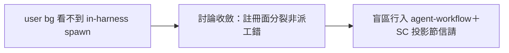

## Description

<!-- SECTION:DESCRIPTION:BEGIN -->
派工可見性討論收斂（codex job-mv04vt81＋GLM job-mv04vty2：註冊面分裂 60%/SC 投影缺口 30%/派工 10%——「不缺事實源，缺消費端投影」）。本卡＝ai-guide 側紀律面一行：agent-workflow skill「Spawn 預設背景」節補已知盲區——非訂閱 session 的 in-harness spawn 對 user viewport 不可見（SC v1 boundary：Background 樹只看當前訂閱 conversation 的 wire slot，CLI metadata.json 不被消費）；需 user 盯防的長弧→named-agent bg 或 bridge（既有分工，不造新機制）。SC 主卡（Background 樹 Session agents 投影組）已信請 southchariot（兩腿證據隨信）。

<!-- SECTION:DESCRIPTION:END -->

## Acceptance Criteria
<!-- AC:BEGIN -->
- [x] #1 agent-workflow skill 盲區一行落地
<!-- AC:END -->

## Definition of Done
<!-- DOD:BEGIN -->
- [ ] #1 instruction 條文 review（static-ish 單行資訊補充）
<!-- DOD:END -->

## Final Summary

<!-- SECTION:FINAL_SUMMARY:BEGIN -->

<!-- SECTION:FINAL_SUMMARY:END -->
