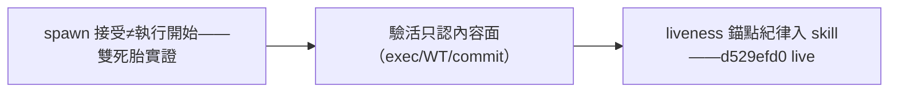

## Description

<!-- SECTION:DESCRIPTION:BEGIN -->
spawn 接受≠執行開始（AIR-288/289 首派雙雙死胎實證：exec 空＋metadata running 凍結 2h＋完成通知永不觸發）。agent-workflow skill 已落 stillbirth 偵測＋liveness 錨點紀律（merge d529efd0——驗活只認內容面：exec 目錄/WT diff/commit；長弧工單必帶空 commit 錨點＋每修一 commit）。本卡=記錄收口（skill 面已 live）。

<!-- SECTION:DESCRIPTION:END -->

## Acceptance Criteria
<!-- AC:BEGIN -->
- [x] #1 skill 條文落地（d529efd0 已驗）
<!-- AC:END -->

## Final Summary

<!-- SECTION:FINAL_SUMMARY:BEGIN -->
skill 面已 live（merge d529efd0）——stillbirth 偵測＋liveness 錨點＋增量 commit 紀律入 agent-workflow；本卡為記錄收口。
<!-- SECTION:FINAL_SUMMARY:END -->
