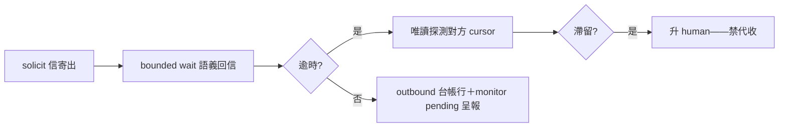
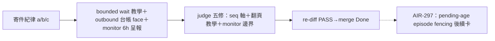

## Description

<!-- SECTION:DESCRIPTION:BEGIN -->
bridge 寄件紀律（第二起 custody 事故產物——SC seq25-30 drain 停擺六信無人知覺）：(a) solicit 信＝雙向契約——寄出後自己地址掛 bounded wait 等語義回信，逾時→唯讀 receive status 探測對方 cursor（cursor 未過我方 seq＝滯留），仍滯→升 human，禁代收（跨 repo 主權）——教學面落 skills/handoff/SKILL.md Phase 5；(b) outbound 台帳一行（envelope_id／目標地址／deliverySeq／寄出時對方 cursor）入 duty_receive/mail_waiter 處理器紀律；(c) duty_mailbox_monitor 擴 pending 停留 >N 小時呈報（跨地址唯讀）。全消費端/caller 側約定，dutymail transport 零變更、不加 daemon/retry/bounce。時序：AIR-288 落地後接（288 修復中 judge 收口條件已凍結，不中途擴 scope）。

<!-- SECTION:DESCRIPTION:END -->

## Acceptance Criteria
<!-- AC:BEGIN -->
- [x] #1 (a) solicit bounded wait 教學落 handoff SKILL Phase 5
- [x] #2 (b) outbound 台帳行入處理器紀律
- [x] #3 (c) monitor pending >N 小時呈報
<!-- AC:END -->

## Definition of Done
<!-- DOD:BEGIN -->
- [x] #1 老規矩審查鏈（codex＋5.3＋judge）
<!-- DOD:END -->

## Final Summary

<!-- SECTION:FINAL_SUMMARY:BEGIN -->

<!-- SECTION:FINAL_SUMMARY:END -->
