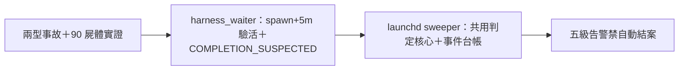

## Description

<!-- SECTION:DESCRIPTION:BEGIN -->
機械偵測面工程（兩型事故：stillbirth＋silent-completion；實證：90/90 running 全凍結、最老 40 天、metadata status 出生寫一次完成轉態不可靠——內容面偵測為唯一可靠訊號）。設計權威＝codex/GLM 討論（.agent-tmp/zombie-disc-codex.md＋zombie-disc-glm.md＋zombie-diag-evidence.txt）：①雙層監督——session-local harness_waiter.py 擴充（spawn+5m START_MISSING 驗活＋COMPLETION_SUSPECTED 候選回收）＋launchd 全域 sweeper（擴充 agent_liveness_sweep.py，共用判定核心）②五級告警（START_MISSING/SILENCE/COMPLETION_SUSPECTED/HARD_DEATH/UNKNOWN——禁自動 TaskStop/重派/寫 completed；重派走 RETRY_SAFE gate）③台帳 schema（attempt_id/registered_at/last_progress_at/last_alert 去重）④判定邏輯修正——以 registered_at/last_progress_at 時間軸，禁 metadata 凍結 vs commit 直接比較。SC 側僅消費事件台帳（正交不依賴）。

<!-- SECTION:DESCRIPTION:END -->

## Acceptance Criteria
<!-- AC:BEGIN -->
- [ ] #1 harness_waiter 擴充：spawn+5m 驗活＋COMPLETION_SUSPECTED 候選
- [ ] #2 launchd sweeper（共用判定核心＋結構化事件台帳）
- [ ] #3 五級告警＋attempt 去重＋禁自動結案
<!-- AC:END -->

## Definition of Done
<!-- DOD:BEGIN -->
- [ ] #1 老規矩審查鏈（codex＋5.3＋judge）
<!-- DOD:END -->

## Implementation Notes

<!-- SECTION:NOTES:BEGIN -->
【GLM 90 樣本校準證據到齊（job-mv0bjovy 重交全文 .agent-tmp/zombie-disc-glm2.md）】母體 3586 具＝89 凍結 running（65 型 A 死胎族＋24 中斷氣族，最老 981h）。**承重發現：metadata.json 終生只寫兩次（spawn＋收尾）——凍結對執行中 agent 是常態，禁當僵屍判準，必須換軸**。真心跳面＝~/.zcode/cli/artifacts/sess_subagent_<agentId>/（每 tool call 一檔）；節奏校準（n=40 完成例）：首檔 p50=12min/p95=38min/max=48min、輪內最大間距 max=106min。**實證校準簽章**：型 A＝running∧artifacts 缺/空∧age>60min；中斷氣＝artifacts 最新檔凍結>180min；型 B＝running∧output.txt 存在→即報（收尾寫一次，誤報≈零）。野外型 B 屍體＝agent_5a9a8ffa（mosaic_alpha MOS-112 修正輪，output.txt 完整回報在場、通知未響）。載體裁定：擴充 scripts/agent_liveness_sweep.py（唯讀 reporter，夜 cron＋/sitrep 按需）非 hook；偵測/處置分離（AIR-135.7）、處置恆人裁。codex 補充：判定軸用 registered_at/last_progress_at 時間軸、禁 metadata 凍結 vs commit 直接比較；五級告警禁自動 TaskStop/重派/寫 completed。證據檔：zombie-disc-codex.md／zombie-disc-glm2.md／zombie-diag-evidence.txt。
<!-- SECTION:NOTES:END -->
