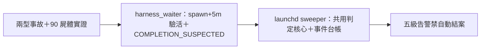

## Description

<!-- SECTION:DESCRIPTION:BEGIN -->
機械偵測面工程（兩型事故：stillbirth＋silent-completion；實證：90/90 running 全凍結、最老 40 天、metadata status 出生寫一次完成轉態不可靠——內容面偵測為唯一可靠訊號）。設計權威＝codex/GLM 討論（.agent-tmp/zombie-disc-codex.md＋zombie-disc-glm.md＋zombie-diag-evidence.txt）：①雙層監督——session-local harness_waiter.py 擴充（spawn+5m START_MISSING 驗活＋COMPLETION_SUSPECTED 候選回收）＋launchd 全域 sweeper（擴充 agent_liveness_sweep.py，共用判定核心）②五級告警（START_MISSING/SILENCE/COMPLETION_SUSPECTED/HARD_DEATH/UNKNOWN——禁自動 TaskStop/重派/寫 completed；重派走 RETRY_SAFE gate）③台帳 schema（attempt_id/registered_at/last_progress_at/last_alert 去重）④判定邏輯修正——以 registered_at/last_progress_at 時間軸，禁 metadata 凍結 vs commit 直接比較。SC 側僅消費事件台帳（正交不依賴）。

<!-- SECTION:DESCRIPTION:END -->

## Acceptance Criteria
<!-- AC:BEGIN -->
- [ ] #1 harness_waiter 擴充：spawn+5m 驗活＋COMPLETION_SUSPECTED 候選
- [ ] #2 launchd sweeper（共用判定核心＋結構化事件台帳）
- [ ] #3 五級告警＋attempt 去重＋禁自動結案
<!-- AC:END -->

## Definition of Done
<!-- DOD:BEGIN -->
- [ ] #1 老規矩審查鏈（codex＋5.3＋judge）
<!-- DOD:END -->
