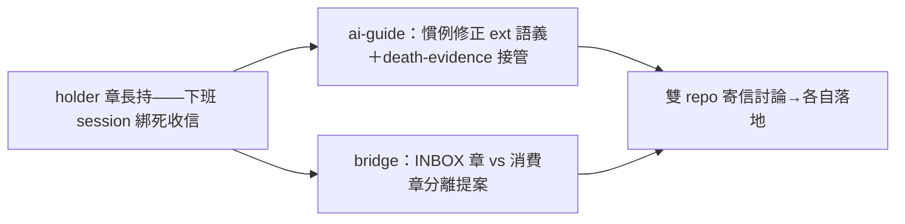

## Description

<!-- SECTION:DESCRIPTION:BEGIN -->
AIR-294 bi 分歧 Arbiter 裁決 codex F3（Important/Evidence-based）後續卡：`hooks/duty_mailbox_monitor.py` 的跨 session 共享年齡帳 `pending-age.json` 採 atomic replace last-writer-wins、無 fencing——「A 舊寫延遲反超 B 清帳」可復活已清帳 episode 的 `stall_reported=True`，後果＝單 episode 漏報一次（advisory 面、窗窄——AIR-294 修補僅補 docstring 邊界註記並明示「接受，fencing 不引入（後續卡）」）。本卡封閉該邊界：pending-age.json 寫入面引入 episode fencing（episode token 或 CAS）——延遲寫入不得復活已清帳 episode 的 flag；涉及 schema 變更＋既有帳相容處置（AIR-294 judge 裁決原文：episode fencing/CAS 涉 schema 變更，後續卡追蹤）。裁決指針：`.review/air-294.md` 修復節（裁決全文錄存）；原檔 `/Users/ctai/Github/ai-guide/.agent-tmp/air294-judge-verdict.md`（.agent-tmp 暫存，以其為 best-effort 指針）。

<!-- SECTION:DESCRIPTION:END -->

## Acceptance Criteria
<!-- AC:BEGIN -->
- [ ] #1 pending-age.json 寫入面 fencing 落地（episode token 或 CAS）——延遲寫入不得復活已清帳 episode 的 stall_reported flag（含延遲寫入反超情境測試）
- [ ] #2 schema 變更＋既有 pending-age.json 相容／遷移處置（無 schema 版本帳的舊檔不打爆）
<!-- AC:END -->

## Definition of Done
<!-- DOD:BEGIN -->
- [ ] #1 老規矩審查鏈（規模比照 AIR-294：codex＋judge）
<!-- DOD:END -->

## Implementation Notes

<!-- SECTION:NOTES:BEGIN -->
【裁決機制原文（AIR-294 bi 分歧 Arbiter，codex F3 段節錄）】last-writer-wins 無 fencing 下「A 舊寫延遲反超 B 清帳、復活 stall_reported=True」窗口屬實；觸發窗＝跨 session 讀改寫毫秒交錯、後果＝advisory 單 episode 漏報一次；問題核心是 monitor docstring「後果方向安全」論證未涵蓋亂序復活——安全性宣稱不完備屬誠實性問題（該註記已隨 AIR-294 必修 5 落地）；episode fencing/CAS 涉 schema 變更，後續卡追蹤。
<!-- SECTION:NOTES:END -->
